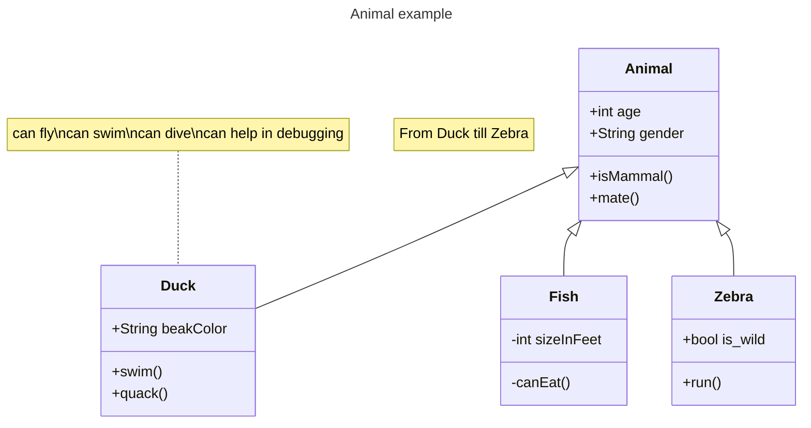

# seminario-1

## introdução 

- item
- item
- item

1. valor
2. valor
3. valor

[Mermaid Class Diagram.html](https://mermaid.js.org/syntax/classDiagram.html)

[Markdown](https://docs.github.com/pt/get-started/writing-on-github/getting-started-with-writing-and-formatting-on-github/basic-writing-and-formatting-syntax)
