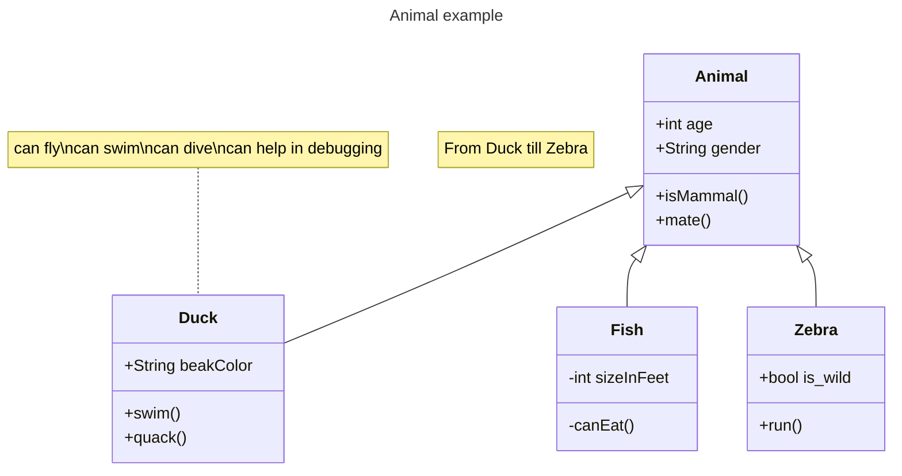

# Builder

## Intenção
Separar a construção de um objeto complexo da sua representação de modo que o
mesmo processo de construção possa criar diferentes representações.
## Motivação 

Imagine que você está construindo casas. Cada casa pode ter diferentes características, como materiais, design, número de cômodos, ou até mesmo o estilo arquitetônico (moderno, clássico, minimalista).

Em vez de construir cada casa do zero manualmente e misturar todos os detalhes da construção, você contrata um arquiteto (o Builder). Esse arquiteto é especializado em planejar e organizar os passos para criar casas específicas de acordo com as suas necessidades. Um gerente de obra (o Director) coordena o trabalho do arquiteto, garantindo que a construção siga o plano correto.

Se você quiser construir uma casa moderna, contrata um arquiteto especializado em design moderno. Se preferir uma casa clássica, escolhe outro arquiteto. O gerente de obras é sempre o mesmo, mas ele coordena o trabalho com base no arquiteto selecionado.

Aplicando ao software:
O Builder é útil quando você precisa criar diferentes representações ou versões de um objeto complexo, mas quer manter o processo de criação (a lógica de montagem) separado dos detalhes específicos de cada versão. Ele permite que você:

Reaproveite a lógica do "gerente" (o Director) para criar objetos diferentes.
Simplifique a manutenção e a adição de novos tipos de representações sem modificar o processo principal.

## Participantes
Builder (Arquiteto)

Especifica uma interface abstrata para projetar e montar as partes de uma casa (ou produto).
Exemplo: Planeja os cômodos, o telhado, as portas e outros detalhes estruturais.
ConcreteBuilder (Arquiteto de Casa Moderna, Arquiteto de Casa Clássica)

Implementa a interface do Builder para criar partes específicas da casa.
Mantém os detalhes e o design específico da casa sendo construída.
Exemplo: Um arquiteto especializado em casas modernas vai criar designs com janelas amplas e linhas retas, enquanto o de casas clássicas prioriza ornamentos e telhados inclinados.
Fornece o método para recuperar a casa pronta (por exemplo, GetModernHouse() ou GetClassicHouse()).
Director (Gerente de Obras)

Coordena o processo de construção seguindo um plano pré-definido.
Não se preocupa com os detalhes de cada tipo de casa, apenas segue o plano do arquiteto escolhido.
Exemplo: O gerente supervisiona os trabalhadores para garantir que as casas modernas ou clássicas sejam construídas corretamente.
Product (Casa)

Representa o objeto final criado.
É o resultado do trabalho coordenado pelo Director e definido pelo ConcreteBuilder.
Exemplo: A casa moderna com janelas amplas e linhas retas, ou a casa clássica com ornamentos e telhado inclinado.

[Mermaid Class Diagram.html](https://mermaid.js.org/syntax/classDiagram.html)

[Markdown](https://docs.github.com/pt/get-started/writing-on-github/getting-started-with-writing-and-formatting-on-github/basic-writing-and-formatting-syntax)
