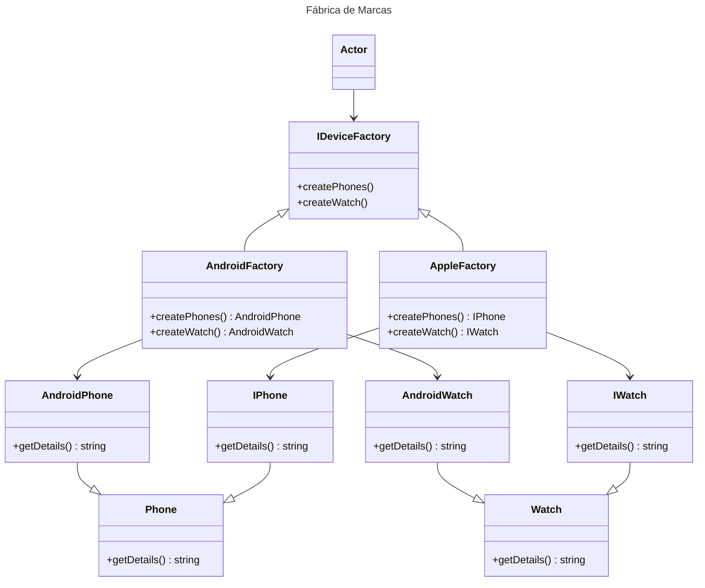
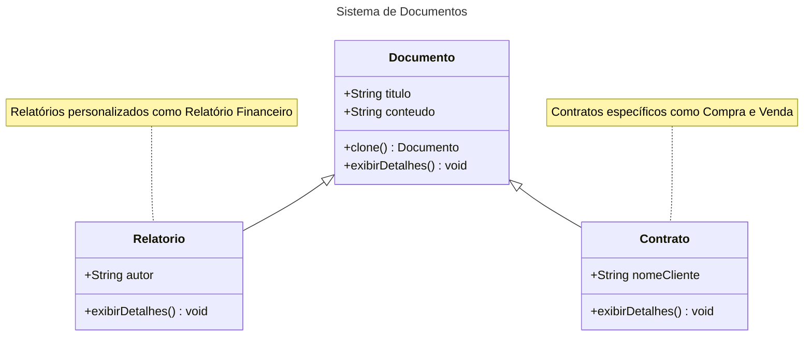
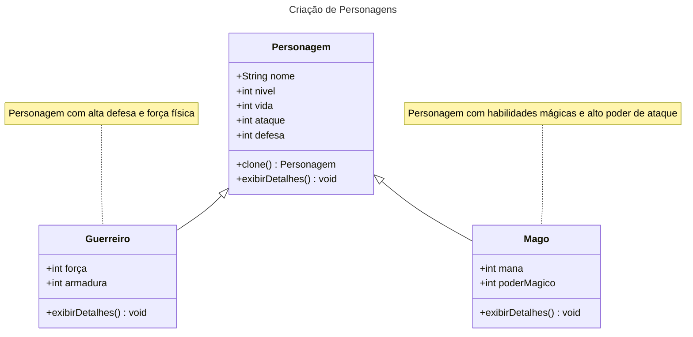
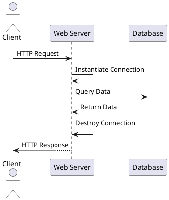
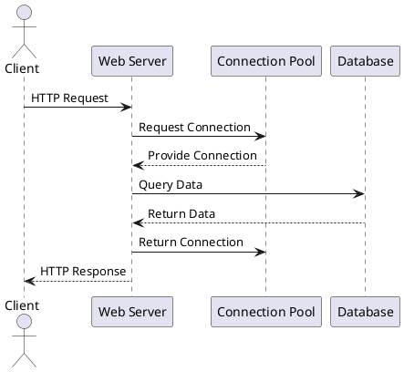
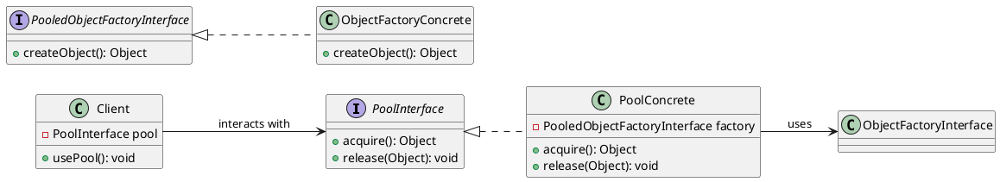

# Abstract Factory

## Intenção
Permite a criação de famílias de objetos relacionados ou dependentes sem especificar suas classes concretas.

## Também conhecido como
Kit de fábrica
Fábrica de fábricas

## Motivação
O código a seguir representa um problema clássico de alto acoplamento e dificuldade de manutenção. 

@import "devicesExample/badCode/src/service/DeviceFactory.ts"


O uso de estruturas como if ou switch para determinar o tipo de dispositivo e suas variantes gera as seguintes limitações:
1. **Complexidade do Cliente**: A lógica para determinar o tipo de dispositivo está embutida na classe DeviceFactory, tornando-a mais difícil de manter e testar.
2. **Dificuldade para Adicionar Novos Produtos**: Sempre que um novo tipo de dispositivo (ou variante) é introduzido, é necessário modificar o método createDevice, violando o princípio aberto/fechado (Open/Closed Principle).

   
`💡 Um design mais modular e flexível pode ser alcançado encapsulando a criação dos dispositivos em fábricas específicas e criando assim um nível de abstração, eliminando a necessidade de lógica condicional dentro do cliente.`


## Aplicabilidade
Use o padrão Abstract Factory quando:
- Um sistema precisa ser independente, gerando uma solução desacoplada para criar produtos relacionados.
- Um sistema precisa ser configurado com uma dentre várias famílias de produtos.
- Desejar garantir que objetos de uma mesma família sejam usados em conjunto.
- Desejar fornecer uma biblioteca de classes de produtos sem alterar o código do cliente e sem expor suas interfaces e implementação.


## Estrutura

```plantuml

    class WidgetFactory {
        +CreateScrollBar()
        +CreateWindow()
    }
    class MotifWidgetFactory extends WidgetFactory  {
        +CreateScrollBar()
        +CreateWindow()
    }
    class PMWidgetFactory  extends WidgetFactory{
        +CreateScrollBar()
        +CreateWindow()
    }
    class Client {
        +operation()
    }
    class ScrollBar
    class MotifScrollBar extends ScrollBar
    class PMScrollBar extends ScrollBar
    class Window
    class MotifWindow extends Window
    class PMWindow  extends Window

    Client --> Window
    Client --> ScrollBar
    MotifWidgetFactory --> MotifScrollBar
    MotifWidgetFactory --> MotifWindow
    PMWidgetFactory --> PMScrollBar
    PMWidgetFactory --> PMWindow
```

## Participantes

### WidgetFactory (Fábrica Abstrata)
- Define uma interface para criar famílias de objetos relacionados, como `CreateScrollBar()` e `CreateWindow()`.

### MotifWidgetFactory e PMWidgetFactory (Fábricas Concretas)
- Implementam a interface `WidgetFactory` para criar produtos específicos.
  - **MotifWidgetFactory**: Cria instâncias de `MotifScrollBar` e `MotifWindow`.
  - **PMWidgetFactory**: Cria instâncias de `PMScrollBar` e `PMWindow`.

### ScrollBar e Window (Produtos Abstratos)
- Representam interfaces ou classes abstratas para os tipos de produtos que serão criados.
  - **ScrollBar**: Interface para barras de rolagem.
  - **Window**: Interface para janelas.

### MotifScrollBar, PMScrollBar, MotifWindow e PMWindow (Produtos Concretos)
- Implementam os produtos abstratos definidos por `ScrollBar` e `Window`.
  - **MotifScrollBar** e **PMScrollBar**: Implementações concretas do produto `ScrollBar`.
  - **MotifWindow** e **PMWindow**: Implementações concretas do produto `Window`.

### Client
- Utiliza apenas as interfaces fornecidas por `WidgetFactory`, `ScrollBar` e `Window` para criar e usar os objetos. 


## Outro exemplo



## Participantes

### IDeviceFactory (Fábrica Abstrata)
- Define a interface para a criação de famílias de produtos relacionados, como `createPhones()` e `createWatch()`.

### AndroidFactory e AppleFactory (Fábricas Concretas)
- Implementam a interface `IDeviceFactory` para criar produtos específicos.
  - **AndroidFactory**: Cria instâncias de `AndroidPhone` e `AndroidWatch`.
  - **AppleFactory**: Cria instâncias de `IPhone` e `IWatch`.

### Phone e Watch (Produtos Abstratos)
- São classes ou interfaces que definem os tipos de produtos criados pelas fábricas.
  - **Phone**: Interface base para os diferentes tipos de telefones.
  - **Watch**: Interface base para os diferentes tipos de relógios.

### AndroidPhone, IPhone, AndroidWatch e IWatch (Produtos Concretos)
- Implementam as interfaces ou classes abstratas definidas por `Phone` e `Watch`.
  - **AndroidPhone**: Implementação concreta do produto `Phone` para dispositivos Android.
  - **IPhone**: Implementação concreta do produto `Phone` para dispositivos Apple.
  - **AndroidWatch**: Implementação concreta do produto `Watch` para dispositivos Android.
  - **IWatch**: Implementação concreta do produto `Watch` para dispositivos Apple.


## Colaborações

- **Cliente e Fábrica Abstrata**: O cliente interage com a interface da Fábrica Abstrata (`AbstractFactory`) para criar famílias de produtos relacionados, sem conhecer as classes concretas.
- **Fábrica Concreta e Produtos Concretos**: Cada Fábrica Concreta (`ConcreteFactory`) cria uma família específica de produtos concretos.
- **Produtos Abstratos e Produtos Concretos**: Os produtos concretos implementam interfaces ou classes abstratas, garantindo que as fábricas concretas possam ser substituídas sem impacto no cliente.

O cliente utiliza a Fábrica Abstrata para criar os objetos, e as Fábricas Concretas instanciam os produtos concretos necessários.


## Consequências

### Benefícios

1. **Consistência entre produtos**: Garante que os produtos criados por uma fábrica pertencem à mesma família e funcionam bem juntos.
   - Exemplo: Um sistema gráfico com botões e barras de rolagem consistentes em estilo.

2. **Isolamento da implementação**: O cliente interage apenas com interfaces ou classes abstratas, deixando o código mais flexível e desacoplado.

3. **Facilidade para introduzir novas famílias de produtos**: Adicionar uma nova família requer apenas criar uma nova Fábrica Concreta e seus produtos concretos.

4. **Organização por famílias**: Estrutura sistemas que precisam criar objetos agrupados logicamente.


### Desvantagens

1. **Aumento da complexidade**: Implementar uma Fábrica Abstrata pode gerar muitas classes (Fábricas Concretas e Produtos Concretos).

2. **Dificuldade em adicionar novos produtos**: Alterar a Fábrica Abstrata para incluir um novo produto afeta todas as Fábricas Concretas existentes.


## Implementação

1. **Definir a Fábrica Abstrata**: Declare métodos para criar cada tipo de produto relacionado.
   ```java
   interface DeviceFactory {
       Phone createPhone();
       Watch createWatch();
   }
   ```

2. **Implementar as Fábricas Concretas**: Implemente a interface da Fábrica Abstrata, criando objetos específicos de uma família.
   ```java
   class AndroidFactory implements DeviceFactory {
       public Phone createPhone() {
           return new AndroidPhone();
       }

       public Watch createWatch() {
           return new AndroidWatch();
       }
   }

   class AppleFactory implements DeviceFactory {
       public Phone createPhone() {
           return new IPhone();
       }

       public Watch createWatch() {
           return new IWatch();
       }
   }
   ```

3. **Definir os Produtos Abstratos**: Crie interfaces ou classes abstratas para os produtos.
   ```java
   interface Phone {
       void getDetails();
   }

   interface Watch {
       void getDetails();
   }
   ```

4. **Implementar os Produtos Concretos**: Implemente os produtos abstratos.
   ```java
   class AndroidPhone implements Phone {
       public void getDetails() {
           System.out.println("Este é um telefone Android.");
       }
   }

   class IPhone implements Phone {
       public void getDetails() {
           System.out.println("Este é um iPhone.");
       }
   }
   ```

5. **Usar o Padrão**: O cliente cria a fábrica concreta desejada e utiliza para criar os produtos.
   ```java
   public class Client {
       public static void main(String[] args) {
           DeviceFactory factory = new AndroidFactory();
           Phone phone = factory.createPhone();
           Watch watch = factory.createWatch();

           phone.getDetails();
           watch.getDetails();
       }
   }
   ```

## Exemplo Completo

Imagine que você quer criar um sistema para produzir telefones e relógios de diferentes marcas:

```java
public interface DeviceFactory {
    Phone createPhone();
    Watch createWatch();
}

public class AndroidFactory implements DeviceFactory {
    public Phone createPhone() {
        return new AndroidPhone();
    }

    public Watch createWatch() {
        return new AndroidWatch();
    }
}

public class AppleFactory implements DeviceFactory {
    public Phone createPhone() {
        return new IPhone();
```
# Builder

## Intenção
Separar a construção de um objeto complexo da sua representação de modo que o
mesmo processo de construção possa criar diferentes representações.
## Motivação 

Imagine desenvolver um sistema onde objetos complexos podem ter diferentes configurações ou versões. Gerenciar a criação desses objetos sem duplicar código e mantendo a flexibilidade para mudanças futuras pode ser um grande desafio. É nesse contexto que o padrão de projeto **Builder** se torna essencial: ele organiza o processo de construção de objetos, separando a lógica de montagem dos detalhes específicos. Isso não apenas facilita a manutenção, mas também permite reutilizar o mesmo processo de construção para criar diversas representações, promovendo clareza e modularidade no código.

## Exemplo Builder:
Imagine que você está construindo casas. Cada casa pode ter diferentes características, como materiais, design, número de cômodos, ou até mesmo o estilo arquitetônico (moderno, clássico, minimalista).

Em vez de construir cada casa do zero manualmente e misturar todos os detalhes da construção, você contrata um arquiteto (o Builder). Esse arquiteto é especializado em planejar e organizar os passos para criar casas específicas de acordo com as suas necessidades. Um gerente de obra (o Director) coordena o trabalho do arquiteto, garantindo que a construção siga o plano correto.


Se você quiser construir uma casa moderna, contrata um arquiteto especializado em design moderno. Se preferir uma casa clássica, escolhe outro arquiteto. O gerente de obras é sempre o mesmo, mas ele coordena o trabalho com base no arquiteto selecionado.

Aplicando ao software:
O Builder é útil quando você precisa criar diferentes representações ou versões de um objeto complexo, mas quer manter o processo de criação (a lógica de montagem) separado dos detalhes específicos de cada versão. Ele permite que você:

Reaproveite a lógica do "gerente" (o Director) para criar objetos diferentes.
Simplifique a manutenção e a adição de novos tipos de representações sem modificar o processo principal.

## Aplicabilidade

- Use o padrão Builder quando:
    - " o algoritmo para criação de um objeto complexo deve ser independente das partes que compõem o objeto e de como elas são montadas."
    - " o processo de construção deve permitir diferentes representações para o objeto que é construído."

## Participantes do Builder: references GOF

- **Builder**
    -  especifica uma interface abstrata para criação de partes de um objetoproduto.
    
- **ConcreteBuilder**
    -  constrói e monta partes do produto pela implementação da interface de Builder;
    -  define e mantém a representação que cria;
    -  Fornece uma interface para recuperação do produto (por exemplo, GetASCIIText, GetTextWidget).
    
- **Director**
    - constrói um objeto usando a interface de Builder.
    
- **Product**.
    -  representa o objeto complexo em construção. ConcreteBuilder constrói a representação interna do produto e define o processo pelo qual ele é montado;
    -  inclui classes que definem as partes constituintes, inclusive as interfaces para a montagem das partes no resultado final.
      
## Estrutura


## Participantes da motivação:

- **Builder (Arquiteto)**  
  - Especifica uma interface abstrata para projetar e montar as partes de uma casa (ou produto).  
  - **Exemplo**: Planeja os cômodos, o telhado, as portas e outros detalhes estruturais.

- **ConcreteBuilder (Arquiteto de Casa Moderna, Arquiteto de Casa Clássica)**  
  - Implementa a interface do Builder para criar partes específicas da casa.  
  - Define e mantém os detalhes e o design específico da casa sendo construída.  
  - Fornece o método para recuperar a casa pronta (por exemplo, `GetModernHouse()` ou `GetClassicHouse()`).  
  - **Exemplo**: Um arquiteto especializado em casas modernas cria designs com janelas amplas e linhas retas, enquanto o de casas clássicas prioriza ornamentos e telhados inclinados.

- **Director (Gerente de Obras)**  
  - Coordena o processo de construção seguindo um plano pré-definido.  
  - Não se preocupa com os detalhes de cada tipo de casa, apenas segue o plano do arquiteto escolhido.  
  - **Exemplo**: O gerente supervisiona os trabalhadores para garantir que as casas modernas ou clássicas sejam construídas corretamente.

- **Product (Casa)**  
  - Representa o objeto final criado.  
  - É o resultado do trabalho coordenado pelo Director e definido pelo ConcreteBuilder.  
  - **Exemplo**: A casa moderna com janelas amplas e linhas retas, ou a casa clássica com ornamentos e telhado inclinado.
 
## Exemplo sem Builder: 


## Exemplo com Builder: 

@startuml
class Casa {
  - fundacao: String
  - paredes: String
  - telhado: String
}

abstract class ConstrutorCasa {
  # casa: Casa
  + criarNovaCasa()
  + getCasa(): Casa
  + {abstract} construirFundacao()
  + {abstract} construirParedes()
  + {abstract} construirTelhado()
}

class ConstrutorCasaModerna extends ConstrutorCasa
class ConstrutorCasaClassica extends ConstrutorCasa

class Diretor {
  - construtor: ConstrutorCasa
  + setConstrutor(construtor: ConstrutorCasa)
  + construirCasa()
  + getCasa(): Casa
}

Diretor --> ConstrutorCasa : usa
ConstrutorCasa --> Casa : cria

note right of ConstrutorCasa
  Construtor concreto
  define como a casa é construída
end note
@enduml


## Colaborações: 

- O Gerente de Obras depende de um arquiteto específico para executar os passos necessários à construção de uma casa. Ele coordena o processo, chamando os métodos do arquiteto em uma sequência definida, sem se preocupar com os detalhes da implementação de cada passo.
- O arquiteto é responsável por construir as partes individuais da casa (fundação, paredes, telhado) e entregar o resultado final. Cada implementação do arquiteto conhece os detalhes específicos de um estilo de casa.
- O Gerente de Obras obtém a casa finalizada do arquiteto e a entrega ao cliente ou a utiliza em outra parte do sistema.
- O cliente especifica ao Gerente de Obras qual tipo de casa deseja construir. O Gerente de Obras então escolhe o arquiteto apropriado para realizar o trabalho

## Consequências:

1. Separação entre o processo de construção e a representação final:
- O padrão isola a lógica de criação da estrutura de um objeto, permitindo modificar a maneira como os objetos são construídos sem alterar sua lógica interna.
- A lógica para construir o objeto é centralizada no Director, enquanto os detalhes específicos ficam nos Builders. Isso facilita a criação de diferentes representações (casas modernas, clássicas, etc.) sem duplicar código.
Manutenção facilitada:

2. Novos tipos de representações podem ser adicionados criando novos Builders, sem modificar o código do Director, promovendo o princípio Open/Closed.
Facilidade na construção de objetos complexos:
- O padrão organiza a construção de objetos que possuem muitos passos e dependências, mantendo o código mais limpo e legível.
- Permite que o Director controle a sequência e os detalhes da construção sem se preocupar com os atributos específicos de cada tipo de objeto.
- A implementação do padrão adiciona várias classes (como Builder, ConcreteBuilders e Director), o que pode ser considerado um overhead desnecessário em sistemas simples.
- Para sistemas pequenos ou com objetos simples, o uso do padrão pode parecer excessivo, já que criar uma classe para cada variação de objeto pode ser desnecessário

## Implementação:

O Cliente escolhe o tipo de objeto que deseja construir e passa essa decisão para o Director.
O Director recebe um Builder (por exemplo, ArquitetoCasaModerna) e chama os métodos do Builder em uma sequência pré-definida.
O ConcreteBuilder executa os métodos e configura as partes do objeto (Casa), armazenando o estado internamente.
Após completar o processo, o ConcreteBuilder retorna o objeto final para o Cliente.


### Exemplo:

```java

class Casa {
    private String fundacao;
    private String paredes;
    private String telhado;

    public void setFundacao(String fundacao) {
        this.fundacao = fundacao;
    }

    public void setParedes(String paredes) {
        this.paredes = paredes;
    }

    public void setTelhado(String telhado) {
        this.telhado = telhado;
    }

    @Override
    public String toString() {
        return "Casa com fundação: " + fundacao + ", paredes: " + paredes + ", telhado: " + telhado;
    }
}

// Interface Builder
abstract class ConstrutorCasa {
    protected Casa casa;

    public void criarNovaCasa() {
        casa = new Casa();
    }

    public Casa getCasa() {
        return casa;
    }

    public abstract void construirFundacao();
    public abstract void construirParedes();
    public abstract void construirTelhado();
}

// ConcreteBuilder: ConstrutorCasaModerna
class ConstrutorCasaModerna extends ConstrutorCasa {

    @Override
    public void construirFundacao() {
        casa.setFundacao("Fundação de concreto reforçado");
    }

    @Override
    public void construirParedes() {
        casa.setParedes("Paredes de vidro e aço");
    }

    @Override
    public void construirTelhado() {
        casa.setTelhado("Telhado plano com painéis solares");
    }
}

// ConcreteBuilder: ConstrutorCasaClassica
class ConstrutorCasaClassica extends ConstrutorCasa {

    @Override
    public void construirFundacao() {
        casa.setFundacao("Fundação de concreto tradicional");
    }

    @Override
    public void construirParedes() {
        casa.setParedes("Paredes de tijolo");
    }

    @Override
    public void construirTelhado() {
        casa.setTelhado("Telhado inclinado de telhas cerâmicas");
    }
}

    public Watch createWatch() {
        return new IWatch();
```
# Prototype

### Padrão de Projeto Criacional

## Intenção

Tem como objetivo permitir a criação de novos objetos a partir de um modelo (template) ou protótipo existente, em vez de criar uma nova instância do zero. Facilitando na criação de novos objetos que são complexos ou tem inicialização custosa, permitindo uma clonagem eficiente dos objetos, com a possibilidade de modificar ou customizar os novos objetos conforme necessário.


## Motivação

Imagine que você trabalha em uma empresa de automação de processos, e o desafio do momento é criar um sistema de gerenciamento de documentos. Cada documento pode ter um título e conteúdo personalizado, como contratos, atas de reunião e propostas comerciais.

Inicialmente, você planejou criar novas instâncias de documentos usando construtores para preencher manualmente o título e o conteúdo. Mas, à medida que os requisitos cresceram, ficou claro que certos documentos, como um contrato padrão ou uma ata de reunião básica, eram frequentemente reutilizados com pequenas alterações. Cada vez que um usuário queria criar um novo contrato, precisava preencher todos os detalhes novamente, o que era ineficiente e sujeito a erros.

Então, surge a ideia: e se você pudesse simplesmente clonar um modelo existente de documento, ajustando apenas as informações necessárias? É aqui que o padrão Prototype entra em cena.

No seu sistema, você implementa uma classe abstrata Documento que define o título e o conteúdo. Essa classe também implementa a interface Cloneable para permitir que instâncias de documentos sejam copiadas. Com isso, você pode criar protótipos de documentos (como "Contrato Padrão" ou "Ata Básica") e simplesmente cloná-los quando necessário.

Por exemplo:

Quando o departamento de vendas precisa de um novo contrato, o sistema clona o protótipo do contrato padrão e insere as informações do cliente.
Para atas de reunião, o sistema utiliza o protótipo da ata básica, ajustando o conteúdo com os detalhes da reunião específica.


## Aplicabilidade
O padrão Prototype é ideal em cenários onde se busca maior flexibilidade e eficiência no processo de criação de objetos. Ele é recomendado nos seguintes casos:

Independência da criação de objetos: Quando é necessário que o sistema funcione de forma independente de como os objetos são criados, compostos ou representados. Isso reduz o acoplamento e simplifica a manutenção.

Definição dinâmica das classes a serem instanciadas: Em situações onde as classes de objetos precisam ser especificadas durante a execução do programa, como em sistemas que utilizam carregamento dinâmico de dados ou componentes.

Evitar hierarquias de classes complexas: Quando seria necessário criar uma hierarquia paralela de classes de fábrica para suportar a criação de produtos. O Prototype elimina essa necessidade ao permitir que os objetos sejam clonados diretamente.

Gerenciamento eficiente de estados diferentes: Quando uma classe pode assumir apenas um número limitado de combinações de estados, é mais prático criar protótipos para cada configuração inicial e cloná-los conforme necessário, em vez de configurar manualmente cada instância repetidamente.


## Estrutura


## Participantes 

- Documento (abstrato): Define os atributos e métodos comuns de um documento. 
- Contrato (clone): Utiliza como modelo (template) a classe documento, e adiciona um atrituto específico do contrato.
- Relatorio (clone): Utiliza como modelo (template) a classe documento, e adiciona um atrituto específico do relatório.

## Outro Exemplo

## Participantes

- Personagem (abstrato): Define os atributos e métodos comuns para todos os personagens.
- Guerreiro (clone): Representa um personagem do tipo Guerreiro, com atributos relacionados à força e defesa.
- Mago (clone): Representa um personagem do tipo Mago, com atributos relacionados à mana e poder mágico.


## Consequências
Prototype tem muitas das mesmas consequências que o Abstract Factory e Builder:
- Oculta as classes de produtos concretos do cliente, reduzindo a quantidade de informações que ele precisa conhecer, permitindo que o cliente crie novos objetos a partir de protótipos existentes, sem precisar entender ou interagir diretamente com o código das classes concretas.
  
### Benefícios adicionais do Prototype:

1. Modificação dinâmica de protótipos: O padrão permite modificar ou estender protótipos de objetos durante a execução do programa.
2. Criação de objetos com valores variados: Permite criar novos objetos com diferentes valores baseados em um protótipo, ajustando suas propriedades conforme necessário.
3. Variação de estrutura através de clonagem: A estrutura de um objeto pode ser alterada ao cloná-lo a partir de um protótipo e adicionar ou modificar seus atributos.
4. Redução de subclasses: Evita a criação de múltiplas subclasses, criando objetos a partir de protótipos e personalizando-os conforme necessário.
5. Criação dinâmica de objetos: O padrão Prototype permite criar e configurar objetos de maneira dinâmica, sem a necessidade de uma hierarquia rígida de classes.

- O ponto fraco do Prototype é a complexidade envolvida na clonagem de objetos com estruturas internas complexas. Quando um objeto possui referências a outros objetos ou contém um estado interno complexo, pode ser difícil garantir que a clonagem seja feita corretamente, sem gerar problemas como cópias superficiais em vez de cópias profundas (deep copies). Isso pode resultar em erros, como a modificação indesejada de objetos compartilhados entre o protótipo e suas cópias, além de aumentar a complexidade do código para gerenciar essas clonagens de maneira eficaz.


## Implementação 
 ### Pode ser um desafio implementar de maneira correta o padrão prototype, dentre eles:
1. Implementar a operação de clonagem corretamente : O padrão Prototype exige a implementação de uma operação de clonagem precisa para garantir que o novo objeto seja uma cópia exata do protótipo, sem causar problemas como referências compartilhadas inadvertidas.

2. Gerenciar protótipos de forma eficiente : Em sistemas complexos, pode ser difícil organizar e manter os protótipos de maneira eficiente, garantindo que eles sejam facilmente reutilizáveis e adaptáveis para diferentes tipos de objetos.

3. Garantir a inicialização adequada dos clones: Quando se clona um objeto, é importante garantir que a inicialização do clone seja feita corretamente, com todos os atributos e estados sendo copiados ou ajustados de acordo com o comportamento desejado.

### Processo de clonagem
  
O processo de clonagem de um objeto pode ser feito usando duas abordagens:

1. Shallow Copy (ou cópia superficial): 
Copia os valores primitivos e as referências dos objetos, mas não os objetos em si. As referências no novo objeto apontam para os mesmos objetos que as do original, ou seja, o objeto pai é clonado, mas seus filhos são compartilhados entre os objetos.

2. Deep Copy (ou cópia profunda):
Copia o objeto e todos os objetos aos quais ele se refere, criando novas instâncias para todos os elementos. O objeto pai e todos os objetos contidos nele são clonados, garantindo que não haja referências compartilhadas.

- Na implementação, você pode achar o prototype bastante parecido com a **Herança**, pois ambos permitem que objetos ou classes compartilhem propriedades e métodos. No entanto, eles são diferentes em sua implementação e estrutura.
  
- A herança clássica é baseada em classes e estabelece uma hierarquia fixa entre elas, onde as subclasses herdam os métodos e propriedades das classes pai. Já o prototype é baseado em objetos e referências de protótipos, permitindo que objetos compartilhem comportamento dinamicamente. A herança clássica é mais rígida e hierárquica, enquanto o prototype oferece flexibilidade, pois as relações podem ser modificadas em tempo de execução.
  
- Dito isso, no JavaScript, é possível simular o mecanismo da herança, utilizando o prototype para compartilhar propriedades e métodos entre objetos. Embora o JavaScript não tenha um sistema de classes como em linguagens tradicionais, ele permite que objetos "herdem" comportamentos de outros objetos por meio das suas referências de protótipo. Isso é feito de forma dinâmica, permitindo flexibilidade, como a capacidade de modificar ou substituir o protótipo de um objeto a qualquer momento, sem a necessidade de uma hierarquia fixa de classes.

## Exemplo de código 
### 1. Criando classe abstrata, que servirá como protótipo
```java
 public abstract class Documento implements Cloneable {
    private String titulo;
    private String conteudo;

    public Documento(String titulo, String conteudo) {
        this.titulo = titulo;
        this.conteudo = conteudo;
    }

    public String getTitulo() {
        return titulo;
    }

    public void setTitulo(String titulo) {
        this.titulo = titulo;
    }
}

public interface Phone {
    void getDetails();
}

public class AndroidPhone implements Phone {
    public void getDetails() {
        System.out.println("Telefone Android criado.");
    }
}

public class IPhone implements Phone {
    public void getDetails() {
        System.out.println("iPhone criado.");
    }
}

public String getConteudo() {
        return conteudo;
    }

    public void setConteudo(String conteudo) {
        this.conteudo = conteudo;
    }

    @Override
    public Documento clone() {
        try {
            return (Documento) super.clone();
        } catch (CloneNotSupportedException e) {
            throw new RuntimeException("Erro ao clonar documento!", e);
        }
    }

    public abstract void exibirDetalhes();
}
 
```
**Explicação: A classe Documento é abstrata e implementa a interface Cloneable, permitindo que objetos derivados sejam clonados. Ela possui dois atributos, titulo e conteudo, com métodos getters e setters para acesso e modificação. O método clone() é sobrescrito para criar uma cópia do documento utilizando o método super.clone(), realizando uma clonagem superficial. Além disso, a classe contém um método abstrato exibirDetalhes(), que deve ser implementado pelas subclasses para exibir informações específicas do documento. Essa estrutura facilita a criação de diferentes tipos de documentos com base em um modelo comum.**

### 2. Criando a classe Contrato, que é uma cópia da classe Documento
```java
public class Contrato extends Documento {
    private String nomeCliente;

    public Contrato(String titulo, String conteudo, String nomeCliente) {
        super(titulo, conteudo);
        this.nomeCliente = nomeCliente;
    }

    public String getNomeCliente() {
        return nomeCliente;
    }

    public void setNomeCliente(String nomeCliente) {
        this.nomeCliente = nomeCliente;
    }

    @Override
    public void exibirDetalhes() {
        System.out.println("Contrato:");
        System.out.println("Título: " + getTitulo());
        System.out.println("Conteúdo: " + getConteudo());
        System.out.println("Cliente: " + nomeCliente);
        System.out.println();
    }
}
```
**Explicação: A classe Contrato estende a classe Documento e adiciona um atributo específico, nomeCliente, que representa o nome do cliente associado ao contrato. O construtor da classe Contrato chama o construtor da classe pai Documento para inicializar os atributos titulo e conteudo, além de inicializar nomeCliente. Os métodos getNomeCliente() e setNomeCliente() permitem acessar e modificar o nome do cliente. O método exibirDetalhes() é uma implementação do método abstrato da classe pai, exibindo as informações completas do contrato, incluindo o título, o conteúdo e o nome do cliente, proporcionando uma exibição dos detalhes do contrato.**

### 3. Conclusão
O código define uma estrutura de documentos utilizando o padrão Prototype. A classe Documento é abstrata e implementa a interface Cloneable, permitindo a clonagem de objetos. Ela possui atributos básicos como titulo e conteudo, com métodos para acessá-los e modificá-los, e um método abstrato exibirDetalhes() que deve ser implementado nas subclasses. A classe Contrato estende Documento, adicionando o atributo nomeCliente e implementando o método exibirDetalhes() para mostrar informações específicas do contrato. Essa estrutura permite a criação de documentos clonáveis e personalizados, como contratos, facilitando a reutilização e modificação de objetos sem a necessidade de reescrever todo o conteúdo.


## Usos Conhecidos 

### O padrão Prototype está bastante presente nos dias atuais, exploraremos alguns exemplos práticos utilizados no dia a dia, tanto no desenvolvimento de software quanto em outras áreas, que por muitas vezes acabamos nem percebendo.

1. Desenvolvimento de Jogos:

Unity e Unreal Engine: Ao criar NPCs (personagens não jogáveis) em jogos, desenvolvedores geralmente definem um protótipo básico para cada tipo de personagem (ex.: soldado, mago). Depois, esses protótipos são clonados e ajustados com atributos específicos (como aparência, habilidades ou comportamento) para economizar tempo e recursos. Um mago genérico pode servir de base para criar variações como "Mago de Gelo" ou "Mago de Fogo", ajustando apenas as habilidades.

2. Gerenciamento de Documentos e Relatórios:

Microsoft Office Templates: Usuários criam um modelo de documento no Word ou Excel e depois clonam esse modelo para criar documentos ou planilhas específicos. O protótipo carrega o layout, estilos e formatos pré-definidos, economizando esforço.

3. Interfaces de Usuário (UI):

ReactJS e Angular: No desenvolvimento frontend, componentes reutilizáveis como botões, cards e formulários são criados como protótipos. Esses componentes são clonados e personalizados com propriedades específicas, como cor, texto ou comportamento.

Frameworks de design como Material UI ou Bootstrap fornecem protótipos básicos de elementos da interface que podem ser ajustados rapidamente.

4. Gerenciamento de Configurações:

Em sistemas que exigem configurações dinâmicas, como em plataformas de e-commerce ou jogos, o padrão Prototype pode ser usado para criar novas configurações baseadas em um modelo inicial. Isso é útil quando as configurações de diferentes módulos ou componentes são semelhantes, mas com pequenas variações.
Em jogos como The Sims, o padrão Prototype é usado para configurar objetos e suas variações (por exemplo, diferentes tipos de sofás com variações de cor e textura).

5. Fluxos de Trabalho e Processos:

O conceito de clonagem de fluxos de trabalho ou processos é uma aplicação interessante do padrão Prototype. Isso permite a criação de diferentes versões de um processo com variações mínimas, com base em um modelo genérico.

GitHub permite configurar templates (protótipos) para issues e pull requests, que podem ser clonados e personalizados para diferentes necessidades ou projetos.

GitHub Actions permite criar workflows (fluxos de trabalho) automatizados para CI/CD (Integração Contínua/Entrega Contínua). Um workflow pode ser criado como um protótipo para tarefas específicas, e versões clonadas desse protótipo podem ser personalizadas para diferentes repositórios ou projetos.

Jira (Gestão de Projetos):
No Jira, fluxos de trabalho padrão, como o de desenvolvimento de software, são criados como protótipos. Um fluxo típico pode incluir os estados "To Do", "In Progress", "In Review", e "Done", com transições pré-definidas entre eles. Esses fluxos podem ser clonados e ajustados para diferentes equipes ou projetos

6. Produção em Massa de Produtos:

Indústria Automobilística: Fabricantes de carros, como Toyota ou Tesla, utilizam protótipos para criar diferentes versões de um modelo base. Um carro protótipo pode servir de base para variações, como diferentes motores, cores ou funcionalidades.

No desenvolvimento de produtos digitais, impressoras 3D utilizam o conceito de protótipos para imprimir variações de um modelo básico com ajustes personalizados.


## Padrões Relacionados 
Prototype e Abstract Factory têm em comum o objetivo de **abstrair a criação de objetos**, permitindo ao cliente criar instâncias sem conhecer detalhes de implementação. O Prototype cria objetos clonando um protótipo existente, enquanto o Abstract Factory cria famílias de objetos relacionados. Eles podem ser usados em conjunto, com o Abstract Factory coordenando e armazenando a criação de produtos (protótipos) e o Prototype permitindo clonar e personalizar esses objetos conforme necessário.

## Referências 

GAMMA, Erich; HELM, Richard; JOHNSON, Ralph; VLISSIDES, John. Padrões de Projetos: Soluções Reutilizáveis de Software Orientados a Objetos. Trad. Luiz A. Meirelles Salgado; Fabiano Borges Paulo. 1. ed. Porto Alegre: Bookman, 2000.


[Macoratti.net](https://macoratti.net/21/08/c_prototype1.htm#:~:text=Deep%20Copy%20(ou%20c%C3%B3pia%20profunda,os%20objetos%20que%20o%20cont%C3%AAm. )

## Usos Conhecidos

1. **Sistemas gráficos multiplataforma**: Criar interfaces adaptadas para diferentes sistemas operacionais.
2. **Bibliotecas de persistência**: Fornecer implementações diferentes para diversos tipos de bancos de dados.
3. **Frameworks de jogos**: Configurar texturas, sons e objetos específicos para cada plataforma.


## Conclusão

O padrão **Abstract Factory** é uma solução poderosa para criar famílias de objetos relacionados, mantendo a consistência e a flexibilidade do código. Ele é ideal para sistemas que precisam suportar múltiplas variações de produtos, desde que a complexidade adicional seja gerenciável.


```java
// Diretor
class Diretor {
    private ConstrutorCasa construtor;

    public void setConstrutor(ConstrutorCasa construtor) {
        this.construtor = construtor;
    }

    public void construirCasa() {
        construtor.criarNovaCasa();
        construtor.construirFundacao();
        construtor.construirParedes();
        construtor.construirTelhado();
    }

    public Casa getCasa() {
        return construtor.getCasa();
    }
}

public class BuilderExample {
    public static void main(String[] args) {
        Diretor diretor = new Diretor();

        // Construir uma casa moderna
        ConstrutorCasa construtorModerno = new ConstrutorCasaModerna();
        diretor.setConstrutor(construtorModerno);
        diretor.construirCasa();
        System.out.println(diretor.getCasa());

        // Construir uma casa clássica
        ConstrutorCasa construtorClassico = new ConstrutorCasaClassica();
        diretor.setConstrutor(construtorClassico);
        diretor.construirCasa();
        System.out.println(diretor.getCasa());
    }
}
```

## Usos conhecidos:

O padrão **Builder** é amplamente utilizado em várias situações onde objetos complexos precisam ser criados de maneira flexível e reutilizável.

###  Interface de Criação de GUI (Interfaces Gráficas de Usuário)

**Exemplo**: **Frameworks de interface de usuário como Swing ou JavaFX**
- Em frameworks de interface gráfica, onde você pode criar painéis, botões e menus com várias opções, como texto, ícones, eventos, cores, etc.
- O padrão Builder ajuda a criar componentes complexos de interface sem a necessidade de construir cada elemento manualmente.

**Aplicação**: Frameworks de interface de usuário em Java ou C#, onde você deseja permitir a criação de uma interface flexível e modular.

---

### Construção de Consultas Complexas (Query Builders)

**Exemplo**: Consulta a bancos de dados SQL
- Quando você precisa construir consultas SQL complexas com diversas condições, joins, agrupamentos, etc., o Builder pode ser usado para criar essas consultas de forma legível e modular.
- Isso permite que você adicione facilmente novas cláusulas ou condições sem quebrar o código.

**Aplicação**: Bibliotecas como **Hibernate Criteria API** ou **JPA Criteria API**, que permitem construir consultas dinâmicas e flexíveis sem concatenar strings SQL manualmente.

---

### . Criação de Objetos de Documentos (Exemplo: PDF ou HTML)

**Exemplo**: **Geradores de Documentos**
- Geradores de documentos (PDF, Word, HTML) onde cada documento pode ter diferentes seções, tabelas, listas, parágrafos, imagens, etc.
- O Builder permite que você construa esses documentos de forma modular e eficiente, sem ter que lidar com a complexidade de cada componente individual.

**Aplicação**: Geradores de relatórios PDF em bibliotecas como **Apache PDFBox** ou **iText**, onde os documentos podem ser construídos passo a passo (tabelas, textos, imagens, etc.) utilizando um único objeto `Builder`.

---

###  Criando APIs Fluentes

- Muitas vezes, o padrão Builder é usado para criar **APIs fluentes**, onde você pode encadear chamadas de método de forma legível e fácil de usar, configurando um objeto de forma incremental.
- O padrão é ideal para cenários onde você tem muitas opções de configuração e deseja permitir um fluxo contínuo de chamadas de métodos.

**Aplicação**: Configuração de APIs em bibliotecas Java ou frameworks como **Spring**, onde você pode configurar beans ou objetos de forma incremental, por exemplo, ao definir uma configuração de serviço, a configuração de banco de dados, ou a configuração de segurança.

---

### Construção de Objetos Imutáveis

- Em muitas linguagens de programação, o padrão Builder é utilizado para construir objetos imutáveis, onde os objetos não podem ser alterados após sua criação. 
- O Builder é usado para preencher os valores do objeto durante a construção, e uma vez que o objeto está pronto, ele não pode ser modificado.

**Aplicação**: Uso do Builder em bibliotecas como **Guava** ou **Java**, quando se deseja criar objetos imutáveis com um número variável de parâmetros.

--- 
### Compilação de Modelos de Arquitetura
Arquiteturas de software complexas
O padrão Builder é útil na criação de componentes de software que exigem configuração detalhada, como componentes de sistemas distribuídos ou microserviços, onde cada serviço pode ter diferentes opções de configuração e implementação.
Arquitetura de sistemas distribuídos em que você precisa construir a estrutura de um sistema com múltiplos nós e serviços, cada um com suas próprias configurações e opções.

.
[Mermaid Class Diagram.html](https://mermaid.js.org/syntax/classDiagram.html)


# Object Pool (Padrão Criacional)

## Intenção

Gerenciar a criação, armazenamento, emprestimo, retomada e reutilização de instancias de objeto, com o objetivo de controlar a quantidade de instancias existentes ou previnir o processo de criação e destruição recorentes quando estes forem considerados caros.

## Também conhecido como

Pool de recursos

## Motivação

Para se comunicar com um banco de dados, é necessario estabelecer uma "conexão" com ele:

```java
Connection connection = DriverManager.getConnection(
                "jdbc:mysql://localhost:3306/meu_banco",
                "usuario",
                "senha" )

Statement statement = connection.createStatement();

ResultSet resultSet = statement.executeQuery("SELECT id, nome FROM clientes");
```

Em uma aplicação como um sistema web, onde varias requisições chegam o tempo todo, e para cada requisição é comum termos que acessar o banco de dados uma ou mais vezes, nesse caso, para cada acesso precisariamos instanciar a conexão.




Isso rapidamente apresenta um problema, estabelecer uma conexão com banco de dados é um processo relativamente caro e demorado, é necessario a realização de diversas etapas tanto no servidor de banco quanto no cliente que está se conectando. Além disso, servidores de banco de dados possuem um numero maximo de conexões simultaneas que ele pode manter.

Em um cenario em que por exemplo uma aplicação receba 1000 requisições/s, e para cada requisição sejam necessarias em media 2 consultas ao banco de dados, isso significa que estariamos instanciando e destruindo 2000 conexões por segundo, um numero que facilmente extrapolaria o limite de conexões de um banco de dados.

Em vez disso, usando o pattern de object pool, podemos implementar uma classe que sirva como pool de conexões, dessa forma, ao precisarmos de uma conexão solicitamos ao pool, que ira nos fornecer uma que ja existe. Ao terminamos de usar a conexão, devolvemos ela ao pool.





## Aplicabilidade

Use object pool quando:

- For **demorado** criar uma instancia
- For **caro** em recursos criar uma instancia
- For **demorado** destruir uma instancia
- For **caro** em recursos destruir uma instancia

- Existe um **limite** de quantas instancias possam existir simultaneamente

Com **recursos**, queremos dizer por exemplo cpu, ram, disco e rede por exemplo

Não use object pool quando:

- O **custo** de **manter** a instancia, mesmo quando não está sendo usada, supera o custo de instanciala.

## Estrutura





## Participantes

- **PoolInterface**
    - Define uma interface comum para todas as implementações de classes de pool de objetos
- **ObjectFactoryInterface** 
    - Define uma interface comum para todas as implementações de classes fabricas de objetos que seram guardadas em pool.
- **Client**
   - Aquele que necessita das instancias do objeto que sera guardado em pool.

## Implementação

- Implementação de um pool

```java
package com.example.implementations.simple;

import java.util.ArrayList;
import java.util.List;

import com.example.interfaces.PoolInterface;
import com.example.interfaces.PooledObjectFactory;

public class SimplePool<T> implements PoolInterface<T> {
    private List<T> instanciasLivres; 
    private List<T> instanciasEmUso;  
    private PooledObjectFactory<T> factory;

    public SimplePool(int size, PooledObjectFactory<T> factory) {
        this.factory = factory;
        this.instanciasLivres = new ArrayList<>();
        this.instanciasEmUso = new ArrayList<>();

        for (int i = 0; i < size; i++) {
            instanciasLivres.add(factory.create());
        }
    }

    @Override
    public T acquire() {
        if (!instanciasLivres.isEmpty()) {
            T instance = instanciasLivres.remove(0);  
            instanciasEmUso.add(instance);  
            return instance;
        }
        return null;
    }

    @Override
    public void release(T instance) {
        if (instanciasEmUso.remove(instance)) {
            instanciasLivres.add(instance);
        }
    }

    @Override
    public void destroyAll() {
        for (T instance : instanciasLivres) {
            factory.destroy(instance);
        }
        for (T instance : instanciasEmUso) {
            factory.destroy(instance);
        }
    }
}
```

## Exemplo de código

- Uso de um pool

```java
PoolInterface<CheapObject> pool = new SimplePool<CheapObject>(1, new CheapObjectFactory());

        for (int i = 0; i < 100; i++) {
            CheapObject cheapObject = pool.acquire();
            cheapObject.doSomething();
            pool.release(cheapObject);
        }
```

## Usos conhecidos

- Conexões com bancos de dados geralmente são gerenciados por um object pool

- Servidores web e de aplicação implementam um pool de threads para o processamento de requisições

- Em aplicações multithreads, threads de trabalho são gerenciadas por um object pool

## Padrão relacionados


## Referências
