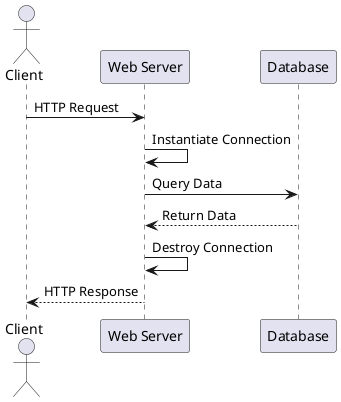
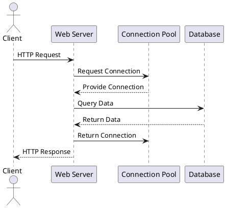
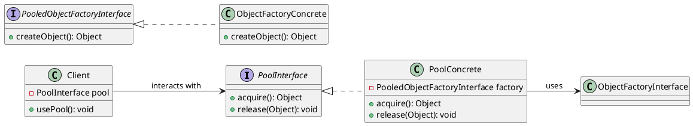

# Object Pool (Padrão Criacional)

## Intenção

Gerenciar a criação, armazenamento, emprestimo, retomada e reutilização de instancias de objeto, com o objetivo de controlar a quantidade de instancias existentes ou previnir o processo de criação e destruição recorentes quando estes forem considerados caros.

## Também conhecido como

Pool de recursos

## Motivação

Para se comunicar com um banco de dados, é necessario estabelecer uma "conexão" com ele:

```java
Connection connection = DriverManager.getConnection(
                "jdbc:mysql://localhost:3306/meu_banco",
                "usuario",
                "senha" )

Statement statement = connection.createStatement();

ResultSet resultSet = statement.executeQuery("SELECT id, nome FROM clientes");
```

Em uma aplicação como um sistema web, onde varias requisições chegam o tempo todo, e para cada requisição é comum termos que acessar o banco de dados uma ou mais vezes, nesse caso, para cada acesso precisariamos instanciar a conexão.


Isso rapidamente apresenta um problema, estabelecer uma conexão com banco de dados é um processo relativamente caro e demorado, é necessario a realização de diversas etapas tanto no servidor de banco quanto no cliente que está se conectando. Além disso, servidores de banco de dados possuem um numero maximo de conexões simultaneas que ele pode manter.

Em um cenario em que por exemplo uma aplicação receba 1000 requisições/s, e para cada requisição sejam necessarias em media 2 consultas ao banco de dados, isso significa que estariamos instanciando e destruindo 2000 conexões por segundo, um numero que facilmente extrapolaria o limite de conexões de um banco de dados.

Em vez disso, usando o pattern de object pool, podemos implementar uma classe que sirva como pool de conexões, dessa forma, ao precisarmos de uma conexão solicitamos ao pool, que ira nos fornecer uma que ja existe. Ao terminamos de usar a conexão, devolvemos ela ao pool.



## Aplicabilidade

Use object pool quando:

- For **demorado** criar uma instancia
- For **caro** em recursos criar uma instancia
- For **demorado** destruir uma instancia
- For **caro** em recursos destruir uma instancia

- Existe um **limite** de quantas instancias possam existir simultaneamente

Com **recursos**, queremos dizer por exemplo cpu, ram, disco e rede por exemplo

Não use object pool quando:

- O **custo** de **manter** a instancia, mesmo quando não está sendo usada, supera o custo de instanciala.

## Estrutura





## Participantes

- **PoolInterface** (Compositor)
    - Define uma interface comum para todas as implementações de classes de pool de objetos
- **ObjectFactoryInterface** 
    - Define uma interface comum para todas as implementações de classes fabricas de objetos que seram guardadas em pool.
- **Client**
- - Aquele que necessita das instancias do objeto que sera guardado em pool.

## Consequências


## Implementação


## Exemplo de código

Daremos o código de alto nível para o exemplo da seção Motivação, o qual está baseado na implementação das classes Composition e Compositor em Inter Views [LCI+92].

A classe Composition mantém uma coleção de Component, a qual representa texto e elementos gráficos num documento. Uma composição arruma os objetos componentes em linhas usando uma instância da subclasse Compositor, a qual encapsula uma estratégia de quebra de linhas. Cada componente tem associados um tamanho natural, uma extensibilidade e uma compressibilidade. A extensibilidade define quanto o componente pode crescer além do seu tamanho natural;compressibilidade é quanto ele pode ser comprimido. A composição passa esses valores para um compositor, o qual os utiliza para determinar a melhor localização para quebras de linha.

```java
public class Composition {
    private Compositor compositor;
    private List<Component> components;// a lista de componentes
    private int componentCount; // o número de componentes
    private int lineWidth; // largura da linha
    private int lineBreaks: // posição das quebras das linhas em componentes
    private int lineCount; // número de linhas

    public Composition (Compositor compositor){
        this.compositor = compositor;
    }
    void repair(){}
}
```
Quando um novo layout é requerido, a composição solicita ao seu compositor determinar onde colocar as quebras de linha. A composição passa para o compositor três vetores que definem tamanhos naturais, extensibilidades e compressibilidades dos componentes. Ela também passa o número de componentes, a largura da linha e um vetor que o compositor preenche com a posição de cada quebra de linha. O compositor devolve o número de quebras calculadas.

A interface de Compositor permite à composição passar ao compositor toda a informação de que ele necessita. Isso é um exemplo da abordagem do tipo "levando os dados para a estratégia":

```java
public interface Compositor {
public int compose(Coord natural[], Coord stretch[], Coord shrink[], int componentCount, int lineWidth, int breaks[]);
```
Note que compositor é uma classe abstrata (ou interface). As subclasses concretas definem estratégias específicas de quebras de linha.

A composição chama a operação *repair* do seu compositor. *repair* primeiramente inicia vetores com tamanho, extensibilidade e compressibilidade naturais de cada componente (cujos detalhes omitiremos). Então, ela chama o compositor para obter as quebras de linha e finalmente estabelece o layout dos componentes de acordo com as quebras (também omitido):
```java
void repair(){
    Coord[] natural;
    Coord[] stretchability:
    Coord[] shrinkability;
    int componentCount;
    int[] breaks;
    // prepara os arrays com os tamanhos desejados dos componentes
    //...
    // determina onde estão as quebras:
    int breakCount;
    breakCount = compositor.compose(natural, stretchability, shrinkability,componentCount, this.lineWidth, breaks);
    // dispõe os componentes de acordo com as quebras
}
```
Examinemos agora as subclasses de Compositor. A classe SimpleCompositor examina componentes uma linha por vez para determinar onde as quebras deveriam ser colocadas:

```java
public class SimpleCompositor implements Compositor{
    public SimpleCompositor{
    }
    public int compose(Coord natural[], Coord stretch[], Coord shrink[], int componentCount, int lineWidth, int breaks[]){
        //...    
    };
};
```

O *TexCompositor* utiliza uma estratégia mais global. Ele examina um parágrafo por vez, levando em conta o tamanho dos componentes e sua extensibilidade. Ele também tenta dar um "aspecto" uniforme ao parágrafo através da minimização dos espaços em branco entre componentes.

```java
public class TexCompositor implements Compositor{
    public TexCompositor{
    }
    public int compose(Coord natural[], Coord stretch[], Coord shrink[], int componentCount, int lineWidth, int breaks[]){
        //...    
    };
};
```

ArrayCompositor quebra os componentes em linhas a intervalos regulares.

```java
public class ArrayCompositor implements Compositor{
    public ArrayCompositor{
    }
    public int compose(Coord natural[], Coord stretch[], Coord shrink[], int componentCount, int lineWidth, int breaks[]){
        //...    
    };
};
```

Essas classes não utilizam toda a informação passada em `Compose`. O `SimpleCompositor` ignora a extensibilidade dos componentes, levando em conta somente suas larguras naturais. O `TeXCompositor` utiliza toda a informação passada para ela, enquanto que `ArrayCompositor` ignora todas.

Para instanciar composition, você passa a ela o compositor que deseja usar:
```java
Composition quick = new Composition (new SimpleCompositor());
Composition slick = new Composition (new TexCompositor());
Composition iconic = new Composition (new ArrayCompositor (100));
```

A interface de Compositor é cuidadosamente projetada para suportar todos os algoritmos de layout que as subclasses possam implementar. Você não deseja ter que mudar esta interface a cada nova subclasse introduzida porque isso exigirá mudar subclasses existentes. Em geral, as interfaces de Strategy eContext determinam também qual padrão consegue o seu intento.

## Usos conhecidos

Tanto ET++ [WGM88] como InterViews usam estratégias para encapsular diferentes algoritmos de quebras de linhas na forma como descrevemos.

No sistema RTL destinado a otimização de código gerado por compiladores [JML92], estratégias definem diferentes esquemas de alocação de registradores (Register Allocator) e procedimentos de utilização (scheduling) do conjunto de instruções (RISCscheduler, CISCscheduler). Isso fornece flexibilidade no direcionamento do otimizador para diferentes arquiteturas de máquina.

O framework para calculadoras *(calculation engine)* do SwapsManager de ET++ computa preços para diferentes instrumentos financeiros [EG92]. Suas abstrações-chave são Instrumente YieldCurve (instrumento e curva de rendimentos, respectivamente). Diferentes instrumentos são implementados como subclasses de Instrument. YieldCurve calcula coeficientes de desconto que determinam o valor presente de fluxos de caixa futuros. Ambas as classes delegam algum comportamento para objetos Strategy. O framework fornece uma família de classes Concrete Strategy para gerar fluxos de caixa, avaliar permutas (swaps) e calcular coeficientes de desconto. Você pode criar novas calculadoras através da configuração de Instrument e YieldCurve com diferentes objetos Concrete Strategy. Esta abordagem suporta a combinação e casamento de implementações existentes de Strategy, bem como a definição de novas implementações.

Os componentes de Booch usam estratégias como argumentos-template. As classes de coleção de Booch suportam três tipos diferentes de estratégias de alocação de memória: administrada (alocação dentro de um pool), controlada (alocações/ desalocações são protegidas por travamentos (locks), e não-administradas (o alocador de memória normal). Essas estratégias são passadas como argumentos-template para uma classe de coleção quando ela é instanciada. Por exemplo, uma Unbounded- Collection que usa a estratégia não-administrada é instanciada como UnboundedCollection<MyItemType*, Unnanaged>,

RApp é um sistema para o layout de circuitos integrados [GA89,AG90]. RAPP deve estabelecer o layout e as rotas dos condutores que conectam subsistemas do circuito. Algoritmos para determinação de rotas no RApp são definidos como subclasses de uma classe abstrata Router. A Router é uma classe Strategy.

ObjectWindows da Borland [Bor94] utiliza estratégias em caixas de diálogo para assegurar que os usuários forneçam dados válidos. Por exemplo, os números devem estar em um certo intervalo, e um campo de entrada numérica deve aceitar somente dígitos. Validar que uma string está correta pode exigir uma pesquisa numa tabela

ObjectWindows utiliza objetos Validator para encapsular estratégias de validação. Validators são exemplos de objetos Strategy. Campos de entrada de dados delegam a estratégia de validação para um objeto Validator opcional. O cliente associa um validator a um campo, se for necessária uma validação (isto é, um exemplo de uma estratégia opcional). Quando o diálogo é fechado, os campos de entrada solicitam aos seus validators para validarem os dados. A biblioteca de classes fornece validators para casos comuns, tal como um RangeValidator (um validator de intervalo) para números. Novas estratégias de validação, específicas do cliente, podem ser definidas facilmente, criando subclasses da classe Validator.

## Padrão relacionados

[Flyweight](Flyweight.md): objetos Strategy geralmente são bons flyweights.


## Referências

<!-- @include: ../../includes/bib.md -->