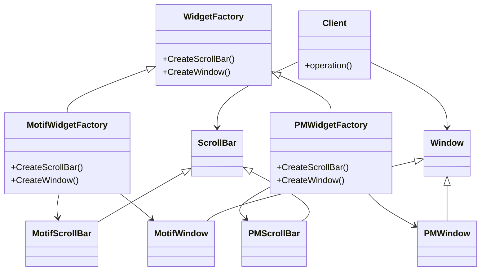
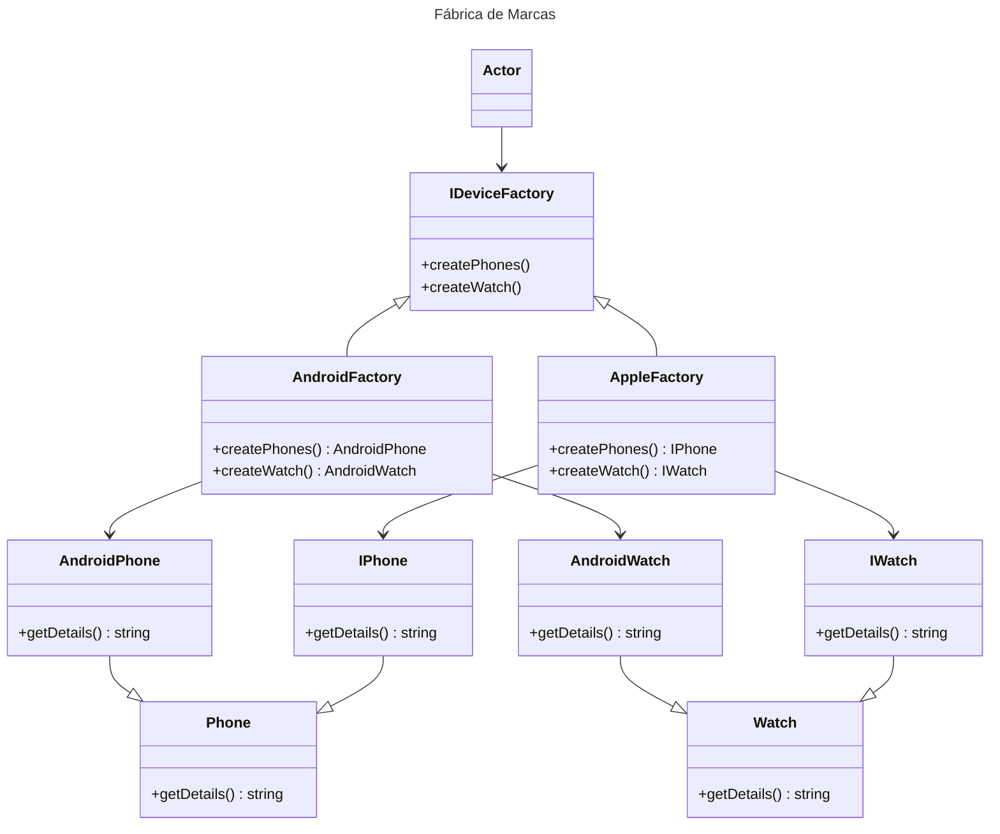

# Abstract Factory

## Intenção
Permite a criação de famílias de objetos relacionados ou dependentes sem especificar suas classes concretas.

## Também conhecido como
Kit de fábrica
Fábrica de fábricas

## Motivação
O código a seguir representa um problema clássico de alto acoplamento e dificuldade de manutenção. 

```typescript
import { AndroidPhone } from "../models/AndroidPhone";
import { AndroidWatch } from "../models/AndroidWatch";
import { ApplePhone } from "../models/ApplePhone";
import { AppleWatch } from "../models/AppleWatch";

export class DeviceFactory {
    createDevice(type: string, device: string): any {
        if (type === "Android" && device === "Watch") {
            return new AndroidWatch();
        } else if (type === "Android" && device === "Phone") {
            return new AndroidPhone();
        } else if (type === "Apple" && device === "Watch") {
            return new AppleWatch();
        } else if (type === "Apple" && device === "Phone") {
            return new ApplePhone();
        } else {
            throw new Error("Invalid type or device");
        }
    }
}
```
O uso de estruturas como if ou switch para determinar o tipo de dispositivo e suas variantes gera as seguintes limitações:
1. **Complexidade do Cliente**: A lógica para determinar o tipo de dispositivo está embutida na classe DeviceFactory, tornando-a mais difícil de manter e testar.
2. **Dificuldade para Adicionar Novos Produtos**: Sempre que um novo tipo de dispositivo (ou variante) é introduzido, é necessário modificar o método createDevice, violando o princípio aberto/fechado (Open/Closed Principle).
   
`💡 Um design mais modular e flexível pode ser alcançado encapsulando a criação dos dispositivos em fábricas específicas e criando assim um nível de abstração, eliminando a necessidade de lógica condicional dentro do cliente.`


## Aplicabilidade
Use o padrão Abstract Factory quando:
- Um sistema precisa ser independente, gerando uma solução desacoplada para criar produtos relacionados.
- Um sistema precisa ser configurado com uma dentre várias famílias de produtos.
- Desejar garantir que objetos de uma mesma família sejam usados em conjunto.
- Desejar fornecer uma biblioteca de classes de produtos sem alterar o código do cliente e sem expor suas interfaces e implementação.


## Estrutura



## Participantes

### WidgetFactory (Fábrica Abstrata)
- Define uma interface para criar famílias de objetos relacionados, como `CreateScrollBar()` e `CreateWindow()`.

### MotifWidgetFactory e PMWidgetFactory (Fábricas Concretas)
- Implementam a interface `WidgetFactory` para criar produtos específicos.
  - **MotifWidgetFactory**: Cria instâncias de `MotifScrollBar` e `MotifWindow`.
  - **PMWidgetFactory**: Cria instâncias de `PMScrollBar` e `PMWindow`.

### ScrollBar e Window (Produtos Abstratos)
- Representam interfaces ou classes abstratas para os tipos de produtos que serão criados.
  - **ScrollBar**: Interface para barras de rolagem.
  - **Window**: Interface para janelas.

### MotifScrollBar, PMScrollBar, MotifWindow e PMWindow (Produtos Concretos)
- Implementam os produtos abstratos definidos por `ScrollBar` e `Window`.
  - **MotifScrollBar** e **PMScrollBar**: Implementações concretas do produto `ScrollBar`.
  - **MotifWindow** e **PMWindow**: Implementações concretas do produto `Window`.

### Client
- Utiliza apenas as interfaces fornecidas por `WidgetFactory`, `ScrollBar` e `Window` para criar e usar os objetos. 


## Outro exemplo



## Participantes

### IDeviceFactory (Fábrica Abstrata)
- Define a interface para a criação de famílias de produtos relacionados, como `createPhones()` e `createWatch()`.

### AndroidFactory e AppleFactory (Fábricas Concretas)
- Implementam a interface `IDeviceFactory` para criar produtos específicos.
  - **AndroidFactory**: Cria instâncias de `AndroidPhone` e `AndroidWatch`.
  - **AppleFactory**: Cria instâncias de `IPhone` e `IWatch`.

### Phone e Watch (Produtos Abstratos)
- São classes ou interfaces que definem os tipos de produtos criados pelas fábricas.
  - **Phone**: Interface base para os diferentes tipos de telefones.
  - **Watch**: Interface base para os diferentes tipos de relógios.

### AndroidPhone, IPhone, AndroidWatch e IWatch (Produtos Concretos)
- Implementam as interfaces ou classes abstratas definidas por `Phone` e `Watch`.
  - **AndroidPhone**: Implementação concreta do produto `Phone` para dispositivos Android.
  - **IPhone**: Implementação concreta do produto `Phone` para dispositivos Apple.
  - **AndroidWatch**: Implementação concreta do produto `Watch` para dispositivos Android.
  - **IWatch**: Implementação concreta do produto `Watch` para dispositivos Apple.


## Colaborações

- **Cliente e Fábrica Abstrata**: O cliente interage com a interface da Fábrica Abstrata (`AbstractFactory`) para criar famílias de produtos relacionados, sem conhecer as classes concretas.
- **Fábrica Concreta e Produtos Concretos**: Cada Fábrica Concreta (`ConcreteFactory`) cria uma família específica de produtos concretos.
- **Produtos Abstratos e Produtos Concretos**: Os produtos concretos implementam interfaces ou classes abstratas, garantindo que as fábricas concretas possam ser substituídas sem impacto no cliente.

O cliente utiliza a Fábrica Abstrata para criar os objetos, e as Fábricas Concretas instanciam os produtos concretos necessários.


## Consequências

### Benefícios

1. **Consistência entre produtos**: Garante que os produtos criados por uma fábrica pertencem à mesma família e funcionam bem juntos.
   - Exemplo: Um sistema gráfico com botões e barras de rolagem consistentes em estilo.

2. **Isolamento da implementação**: O cliente interage apenas com interfaces ou classes abstratas, deixando o código mais flexível e desacoplado.

3. **Facilidade para introduzir novas famílias de produtos**: Adicionar uma nova família requer apenas criar uma nova Fábrica Concreta e seus produtos concretos.

4. **Organização por famílias**: Estrutura sistemas que precisam criar objetos agrupados logicamente.


### Desvantagens

1. **Aumento da complexidade**: Implementar uma Fábrica Abstrata pode gerar muitas classes (Fábricas Concretas e Produtos Concretos).

2. **Dificuldade em adicionar novos produtos**: Alterar a Fábrica Abstrata para incluir um novo produto afeta todas as Fábricas Concretas existentes.


## Implementação

1. **Definir a Fábrica Abstrata**: Declare métodos para criar cada tipo de produto relacionado.
   ```java
   interface DeviceFactory {
       Phone createPhone();
       Watch createWatch();
   }
   ```

2. **Implementar as Fábricas Concretas**: Implemente a interface da Fábrica Abstrata, criando objetos específicos de uma família.
   ```java
   class AndroidFactory implements DeviceFactory {
       public Phone createPhone() {
           return new AndroidPhone();
       }

       public Watch createWatch() {
           return new AndroidWatch();
       }
   }

   class AppleFactory implements DeviceFactory {
       public Phone createPhone() {
           return new IPhone();
       }

       public Watch createWatch() {
           return new IWatch();
       }
   }
   ```

3. **Definir os Produtos Abstratos**: Crie interfaces ou classes abstratas para os produtos.
   ```java
   interface Phone {
       void getDetails();
   }

   interface Watch {
       void getDetails();
   }
   ```

4. **Implementar os Produtos Concretos**: Implemente os produtos abstratos.
   ```java
   class AndroidPhone implements Phone {
       public void getDetails() {
           System.out.println("Este é um telefone Android.");
       }
   }

   class IPhone implements Phone {
       public void getDetails() {
           System.out.println("Este é um iPhone.");
       }
   }
   ```

5. **Usar o Padrão**: O cliente cria a fábrica concreta desejada e utiliza para criar os produtos.
   ```java
   public class Client {
       public static void main(String[] args) {
           DeviceFactory factory = new AndroidFactory();
           Phone phone = factory.createPhone();
           Watch watch = factory.createWatch();

           phone.getDetails();
           watch.getDetails();
       }
   }
   ```

## Exemplo Completo

Imagine que você quer criar um sistema para produzir telefones e relógios de diferentes marcas:

```java
public interface DeviceFactory {
    Phone createPhone();
    Watch createWatch();
}

public class AndroidFactory implements DeviceFactory {
    public Phone createPhone() {
        return new AndroidPhone();
    }

    public Watch createWatch() {
        return new AndroidWatch();
    }
}

public class AppleFactory implements DeviceFactory {
    public Phone createPhone() {
        return new IPhone();
    }

    public Watch createWatch() {
        return new IWatch();
    }
}

public interface Phone {
    void getDetails();
}

public class AndroidPhone implements Phone {
    public void getDetails() {
        System.out.println("Telefone Android criado.");
    }
}

public class IPhone implements Phone {
    public void getDetails() {
        System.out.println("iPhone criado.");
    }
}
```

## Usos Conhecidos

1. **Sistemas gráficos multiplataforma**: Criar interfaces adaptadas para diferentes sistemas operacionais.
2. **Bibliotecas de persistência**: Fornecer implementações diferentes para diversos tipos de bancos de dados.
3. **Frameworks de jogos**: Configurar texturas, sons e objetos específicos para cada plataforma.


## Conclusão

O padrão **Abstract Factory** é uma solução poderosa para criar famílias de objetos relacionados, mantendo a consistência e a flexibilidade do código. Ele é ideal para sistemas que precisam suportar múltiplas variações de produtos, desde que a complexidade adicional seja gerenciável.


