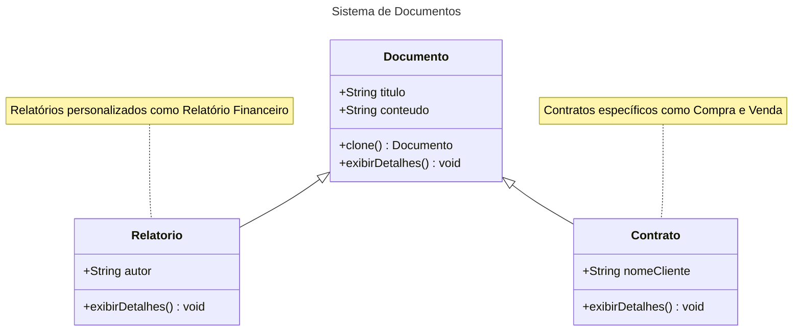
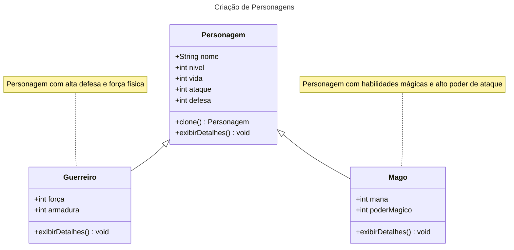

# Prototype

## Intenção

Tem como objetivo permitir a criação de novos objetos a partir de um modelo (template) ou protótipo existente, em vez de criar uma nova instância do zero. Facilitando na criação de novos objetos que são complexos ou tem inicialização custosa, permitindo uma clonagem eficiente dos objetos, com a possibilidade de modificar ou customizar os novos objetos conforme necessário.

## Motivação

Imagine que você trabalha em uma empresa de automação de processos, e o desafio do momento é criar um sistema de gerenciamento de documentos. Cada documento pode ter um título e conteúdo personalizado, como contratos, atas de reunião e propostas comerciais.

Inicialmente, você planejou criar novas instâncias de documentos usando construtores para preencher manualmente o título e o conteúdo. Mas, à medida que os requisitos cresceram, ficou claro que certos documentos, como um contrato padrão ou uma ata de reunião básica, eram frequentemente reutilizados com pequenas alterações. Cada vez que um usuário queria criar um novo contrato, precisava preencher todos os detalhes novamente, o que era ineficiente e sujeito a erros.

Então, surge a ideia: e se você pudesse simplesmente clonar um modelo existente de documento, ajustando apenas as informações necessárias? É aqui que o padrão Prototype entra em cena.

No seu sistema, você implementa uma classe abstrata Documento que define o título e o conteúdo. Essa classe também implementa a interface Cloneable para permitir que instâncias de documentos sejam copiadas. Com isso, você pode criar protótipos de documentos (como "Contrato Padrão" ou "Ata Básica") e simplesmente cloná-los quando necessário.

Por exemplo:

Quando o departamento de vendas precisa de um novo contrato, o sistema clona o protótipo do contrato padrão e insere as informações do cliente.
Para atas de reunião, o sistema utiliza o protótipo da ata básica, ajustando o conteúdo com os detalhes da reunião específica.

## Aplicabilidade
O padrão Prototype é ideal em cenários onde se busca maior flexibilidade e eficiência no processo de criação de objetos. Ele é recomendado nos seguintes casos:

Independência da criação de objetos: Quando é necessário que o sistema funcione de forma independente de como os objetos são criados, compostos ou representados. Isso reduz o acoplamento e simplifica a manutenção.

Definição dinâmica das classes a serem instanciadas: Em situações onde as classes de objetos precisam ser especificadas durante a execução do programa, como em sistemas que utilizam carregamento dinâmico de dados ou componentes.

Evitar hierarquias de classes complexas: Quando seria necessário criar uma hierarquia paralela de classes de fábrica para suportar a criação de produtos. O Prototype elimina essa necessidade ao permitir que os objetos sejam clonados diretamente.

Gerenciamento eficiente de estados diferentes: Quando uma classe pode assumir apenas um número limitado de combinações de estados, é mais prático criar protótipos para cada configuração inicial e cloná-los conforme necessário, em vez de configurar manualmente cada instância repetidamente.

## Estrutura

## Participantes 

- Documento (abstrato)
- Contrato (clone)
- Relatorio (clone)

## Outro Exemplo

## Participantes

- Personagem (abstrato): Define os atributos e métodos comuns para todos os personagens.
- Guerreiro (clone): Representa um personagem do tipo Guerreiro, com atributos relacionados à força e defesa.
- Mago (clone): Representa um personagem do tipo Mago, com atributos relacionados à mana e poder mágico.

## Consequências
Prototype tem muitas das mesmas consequências que o Abstract Factory e Builder:
- Oculta as classes de produtos concretos do cliente, reduzindo a quantidade de informações que ele precisa conhecer, permitindo que o cliente crie novos objetos a partir de protótipos existentes, sem precisar entender ou interagir diretamente com o código das classes concretas.
  
### Benefícios adicionais do Prototype:

1.
2.
3.
4.
5.

- O ponto fraco do Prototype é a complexidade envolvida na clonagem de objetos com estruturas internas complexas. Quando um objeto possui referências a outros objetos ou contém um estado interno complexo, pode ser difícil garantir que a clonagem seja feita corretamente, sem gerar problemas como cópias superficiais em vez de cópias profundas (deep copies). Isso pode resultar em erros, como a modificação indesejada de objetos compartilhados entre o protótipo e suas cópias, além de aumentar a complexidade do código para gerenciar essas clonagens de maneira eficaz.

## Implementação 
- Pode ser um desafio implementar de maneira correta o padrão prototype, dentre eles:
 1. Implementar a operação clone.

 2. Utilizar um gerenciador de prototipos.

 3. Iniciar Clones.

- Processo de clonagem
O processo de clonagem de um objeto pode ser feito usando duas abordagens:
1. Shallow Copy (ou cópia superficial): 
Copia os valores primitivos e as referências dos objetos, mas não os objetos em si. As referências no novo objeto apontam para os mesmos objetos que as do original, ou seja, o objeto pai é clonado, mas seus filhos são compartilhados entre os objetos.
2. Deep Copy (ou cópia profunda):
Copia o objeto e todos os objetos aos quais ele se refere, criando novas instâncias para todos os elementos. O objeto pai e todos os objetos contidos nele são clonados, garantindo que não haja referências compartilhadas.
## Exemplo de código 

## Usos Conhecidos 

## Padrões Relacionados 
Prototype e Abstract Factory têm em comum o objetivo de **abstrair a criação de objetos**, permitindo ao cliente criar instâncias sem conhecer detalhes de implementação. O Prototype cria objetos clonando um protótipo existente, enquanto o Abstract Factory cria famílias de objetos relacionados. Eles podem ser usados em conjunto, com o Abstract Factory coordenando e armazenando a criação de produtos (protótipos) e o Prototype permitindo clonar e personalizar esses objetos conforme necessário.

## Referências 

GAMMA, Erich; HELM, Richard; JOHNSON, Ralph; VLISSIDES, John. Padrões de Projetos: Soluções Reutilizáveis de Software Orientados a Objetos. Trad. Luiz A. Meirelles Salgado; Fabiano Borges Paulo. 1. ed. Porto Alegre: Bookman, 2000.

[Macoratti.net](https://macoratti.net/21/08/c_prototype1.htm#:~:text=Deep%20Copy%20(ou%20c%C3%B3pia%20profunda,os%20objetos%20que%20o%20cont%C3%AAm. )

[Mermaid Class Diagram.html](https://mermaid.js.org/syntax/classDiagram.html)

[Markdown](https://docs.github.com/pt/get-started/writing-on-github/getting-started-with-writing-and-formatting-on-github/basic-writing-and-formatting-syntax)
