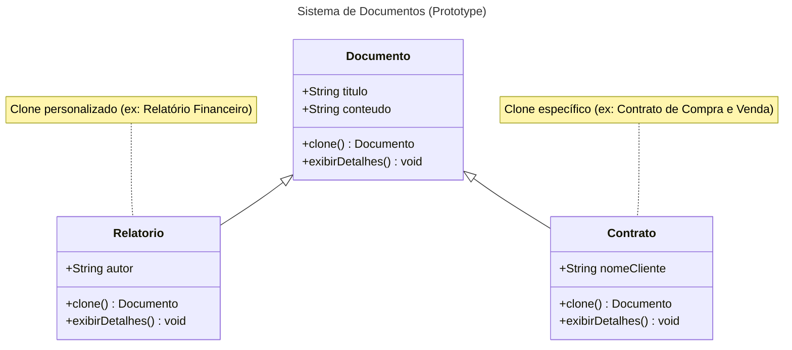
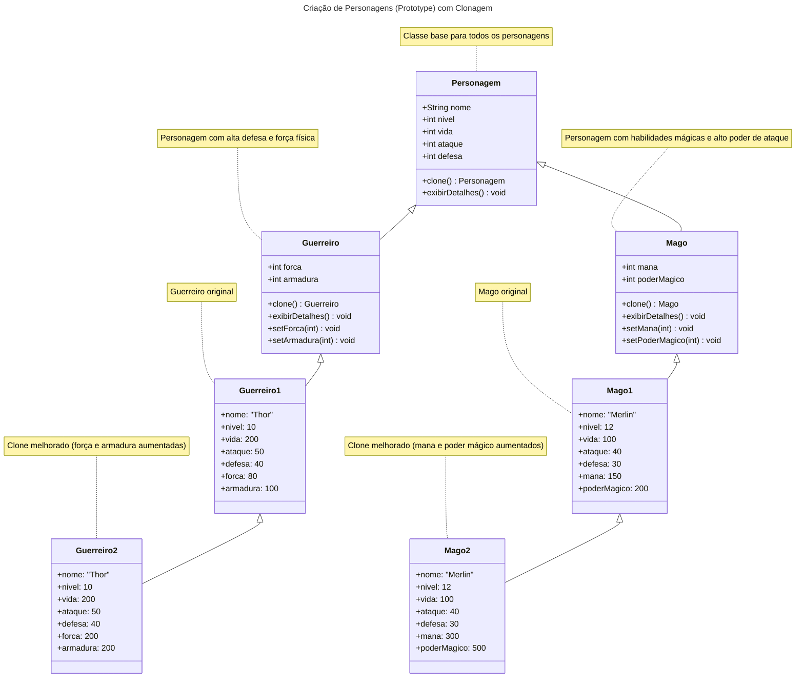
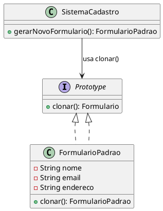

# Prototype

### Padrão de Projeto Criacional

## Intenção

Tem como objetivo permitir a criação de novos objetos a partir de um modelo (template) ou protótipo existente, em vez de criar uma nova instância do zero. Facilitando na criação de novos objetos que são complexos ou tem inicialização custosa, permitindo uma clonagem eficiente dos objetos, com a possibilidade de modificar ou customizar os novos objetos conforme necessário.


## Motivação

Imagine que você trabalha em uma empresa de automação de processos, e o desafio do momento é criar um sistema de gerenciamento de documentos. Cada documento pode ter um título e conteúdo personalizado, como contratos, atas de reunião e propostas comerciais.

Inicialmente, você planejou criar novas instâncias de documentos usando construtores para preencher manualmente o título e o conteúdo. Mas, à medida que os requisitos cresceram, ficou claro que certos documentos, como um contrato padrão ou uma ata de reunião básica, eram frequentemente reutilizados com pequenas alterações. Cada vez que um usuário queria criar um novo contrato, precisava preencher todos os detalhes novamente, o que era ineficiente e sujeito a erros.

Então, surge a ideia: e se você pudesse simplesmente clonar um modelo existente de documento, ajustando apenas as informações necessárias? É aqui que o padrão Prototype entra em cena.

No seu sistema, você implementa uma classe abstrata Documento que define o título e o conteúdo. Essa classe também implementa a interface Cloneable para permitir que instâncias de documentos sejam copiadas. Com isso, você pode criar protótipos de documentos (como "Contrato Padrão" ou "Ata Básica") e simplesmente cloná-los quando necessário.

Por exemplo:

Quando o departamento de vendas precisa de um novo contrato, o sistema clona o protótipo do contrato padrão e insere as informações do cliente.
Para atas de reunião, o sistema utiliza o protótipo da ata básica, ajustando o conteúdo com os detalhes da reunião específica.


## Aplicabilidade
O padrão Prototype é ideal em cenários onde se busca maior flexibilidade e eficiência no processo de criação de objetos. Ele é recomendado nos seguintes casos:

Independência da criação de objetos: Quando é necessário que o sistema funcione de forma independente de como os objetos são criados, compostos ou representados. Isso reduz o acoplamento e simplifica a manutenção.

Definição dinâmica das classes a serem instanciadas: Em situações onde as classes de objetos precisam ser especificadas durante a execução do programa, como em sistemas que utilizam carregamento dinâmico de dados ou componentes.

Evitar hierarquias de classes complexas: Quando seria necessário criar uma hierarquia paralela de classes de fábrica para suportar a criação de produtos. O Prototype elimina essa necessidade ao permitir que os objetos sejam clonados diretamente.

Gerenciamento eficiente de estados diferentes: Quando uma classe pode assumir apenas um número limitado de combinações de estados, é mais prático criar protótipos para cada configuração inicial e cloná-los conforme necessário, em vez de configurar manualmente cada instância repetidamente.


## Estrutura


## Participantes 

- Documento (abstrato): Define os atributos e métodos comuns de um documento. 
- Contrato (clone): Utiliza como modelo (template) a classe documento, e adiciona um atrituto específico do contrato.
- Relatorio (clone): Utiliza como modelo (template) a classe documento, e adiciona um atrituto específico do relatório.

## Outro Exemplo

## Participantes

- Personagem (abstrato): Classe abstrata que define os atributos e métodos comuns para todos os personagens.
- Guerreiro: Representa um personagem do tipo Guerreiro, com atributos relacionados à força física e defesa.
- Guerreiro1: Representa o guerreiro original, com atributos iniciais, forca: 80, armadura: 100
- Guerreiro2 (clone): Representa o clone do Guerreiro1, com atributos melhorados, forca: 200, armadura: 200
- Mago: Representa um personagem do tipo Mago, com atributos relacionados à mana e habilidades mágicas.
- Mago1: Representa o mago original, com atributos iniciais, mana: 150, poderMagico: 200
- Mago2 (clone): Representa o clone do Mago1, com atributos melhorados, mana: 300, poderMagico: 500


## Diferença entre Herança e Clone 
- Herança: Define uma relação "é um" entre classes. A subclasse herda comportamentos e atributos da superclasse, mas o comportamento é fixo após a definição da classe.

- Prototype: Define uma relação "copia de" entre objetos. Você cria novos objetos clonando um protótipo existente e personalizando conforme seja necessário, o que permite flexibilidade em tempo de execução, apenas utilizando o método clone.


## Consequências
Prototype tem muitas das mesmas consequências que o Abstract Factory e Builder:
- Oculta as classes de produtos concretos do cliente, reduzindo a quantidade de informações que ele precisa conhecer, permitindo que o cliente crie novos objetos a partir de protótipos existentes, sem precisar entender ou interagir diretamente com o código das classes concretas.

##  Como linguagens que não são Orientadas a Objetos simulam herança utilizando o Padrão de Projeto Prototype
- Em linguagens que não são orientadas a objetos, o Padrão Prototype pode ser usado para simular herança através da clonagem de objetos ou estruturas de dados. A ideia central é criar um "protótipo" (um objeto ou estrutura base) e, a partir dele, gerar cópias que podem ser personalizadas com atributos ou comportamentos específicos.

- Por exemplo, em linguagens como JavaScript, Python ou até mesmo C, é possível usar dicionários, objetos literais, structs ou funções para criar um protótipo base. Esse protótipo é então clonado, e as cópias são modificadas para adicionar características únicas, simulando o conceito de herança.

```javascript
function Personagem(nome, nivel) {
    this.nome = nome;
    this.nivel = nivel;
}

Personagem.prototype.atacar = function () {
    return `${this.nome} ataca com um golpe básico!`;
};

function Guerreiro(nome, nivel, arma) {
    Personagem.call(this, nome, nivel);
    this.arma = arma;
}

Guerreiro.prototype = Object.create(Personagem.prototype);
Guerreiro.prototype.constructor = Guerreiro;

Guerreiro.prototype.atacar = function () {
    return `${this.nome} ataca com ${this.arma}!`;
};

function Mago(nome, nivel, elemento) {
    Personagem.call(this, nome, nivel);
    this.elemento = elemento;
}

Mago.prototype = Object.create(Personagem.prototype);
Mago.prototype.constructor = Mago;

Mago.prototype.atacar = function () {
    return `${this.nome} lança um feitiço de ${this.elemento}!`;
};

function testarHeranca() {
    const personagemBase = new Personagem("Aventureiro", 1);
    const guerreiro = new Guerreiro("Thor", 5, "Martelo");
    const mago = new Mago("Merlin", 10, "fogo");

    const resultado = `
        <p>${personagemBase.atacar()}</p>
        <p>${guerreiro.atacar()}</p>
        <p>${mago.atacar()}</p>
    `;

    document.getElementById("resultado").innerHTML = resultado;
}
```
#### Explicação:

- A Superclasse Personagem, possui as propriedades nome e nivel, possui um método atacar() compartilhado pelo prototype.

- Subclasse Guerreiro e Subclasse mago usam Personagem.call(this, nome, nivel); para herdar as propriedades e define sua própria propriedade arma e feitiço, usa Object.create(Personagem.prototype) para herdar métodos e sobrescreve o método atacar() com um comportamento específico.

- Essa abordagem permite reutilizar e estender funcionalidades sem a necessidade de classes ou herança tradicional, sendo uma solução flexível e eficaz em linguagens que não possuem suporte nativo a orientação a objetos.

### Benefícios adicionais do Prototype:

1. Modificação dinâmica de protótipos: O padrão permite modificar ou estender protótipos de objetos durante a execução do programa.
2. Criação de objetos com valores variados: Permite criar novos objetos com diferentes valores baseados em um protótipo, ajustando suas propriedades conforme necessário.
3. Variação de estrutura através de clonagem: A estrutura de um objeto pode ser alterada ao cloná-lo a partir de um protótipo e adicionar ou modificar seus atributos.
4. Redução de subclasses: Evita a criação de múltiplas subclasses, criando objetos a partir de protótipos e personalizando-os conforme necessário.
5. Criação dinâmica de objetos: O padrão Prototype permite criar e configurar objetos de maneira dinâmica, sem a necessidade de uma hierarquia rígida de classes.

- O ponto fraco do Prototype é a complexidade envolvida na clonagem de objetos com estruturas internas complexas. Quando um objeto possui referências a outros objetos ou contém um estado interno complexo, pode ser difícil garantir que a clonagem seja feita corretamente, sem gerar problemas como cópias superficiais em vez de cópias profundas (deep copies). Isso pode resultar em erros, como a modificação indesejada de objetos compartilhados entre o protótipo e suas cópias, além de aumentar a complexidade do código para gerenciar essas clonagens de maneira eficaz.


## Implementação 
 ### Pode ser um desafio implementar de maneira correta o padrão prototype, dentre eles:
1. Implementar a operação de clonagem corretamente : O padrão Prototype exige a implementação de uma operação de clonagem precisa para garantir que o novo objeto seja uma cópia exata do protótipo, sem causar problemas como referências compartilhadas inadvertidas.

2. Gerenciar protótipos de forma eficiente : Em sistemas complexos, pode ser difícil organizar e manter os protótipos de maneira eficiente, garantindo que eles sejam facilmente reutilizáveis e adaptáveis para diferentes tipos de objetos.

3. Garantir a inicialização adequada dos clones: Quando se clona um objeto, é importante garantir que a inicialização do clone seja feita corretamente, com todos os atributos e estados sendo copiados ou ajustados de acordo com o comportamento desejado.

### Processo de clonagem
  
O processo de clonagem de um objeto pode ser feito usando duas abordagens:

1. Shallow Copy (ou cópia superficial): 
Copia os valores primitivos e as referências dos objetos, mas não os objetos em si. As referências no novo objeto apontam para os mesmos objetos que as do original, ou seja, o objeto pai é clonado, mas seus filhos são compartilhados entre os objetos.

2. Deep Copy (ou cópia profunda):
Copia o objeto e todos os objetos aos quais ele se refere, criando novas instâncias para todos os elementos. O objeto pai e todos os objetos contidos nele são clonados, garantindo que não haja referências compartilhadas.

- Na implementação, você pode achar o prototype bastante parecido com a **Herança**, pois ambos permitem que objetos ou classes compartilhem propriedades e métodos. No entanto, eles são diferentes em sua implementação e estrutura.
  
- A herança clássica é baseada em classes e estabelece uma hierarquia fixa entre elas, onde as subclasses herdam os métodos e propriedades das classes pai. Já o prototype é baseado em objetos e referências de protótipos, permitindo que objetos compartilhem comportamento dinamicamente. A herança clássica é mais rígida e hierárquica, enquanto o prototype oferece flexibilidade, pois as relações podem ser modificadas em tempo de execução.
  
- Dito isso, no JavaScript, é possível simular o mecanismo da herança, utilizando o prototype para compartilhar propriedades e métodos entre objetos. Embora o JavaScript não tenha um sistema de classes como em linguagens tradicionais, ele permite que objetos "herdem" comportamentos de outros objetos por meio das suas referências de protótipo. Isso é feito de forma dinâmica, permitindo flexibilidade, como a capacidade de modificar ou substituir o protótipo de um objeto a qualquer momento, sem a necessidade de uma hierarquia fixa de classes.

## Exemplo de código 
### 1. Criando classe abstrata, que servirá como protótipo
```java
package PersonagemExemploPrototype;

public abstract class Personagem implements Cloneable {
    protected String nome;
    protected int nivel;
    protected int vida;
    protected int ataque;
    protected int defesa;

    public Personagem(String nome, int nivel, int vida, int ataque, int defesa) {
        this.nome = nome;
        this.nivel = nivel;
        this.vida = vida;
        this.ataque = ataque;
        this.defesa = defesa;
    }

    @Override
    public Personagem clone() {
        try {
            return (Personagem) super.clone();
        } catch (CloneNotSupportedException e) {
            throw new RuntimeException("Erro ao clonar personagem", e);
        }
    }

    public void exibirDetalhes() {
        System.out.println("Nome: " + nome);
        System.out.println("Nível: " + nivel);
        System.out.println("Vida: " + vida);
        System.out.println("Ataque: " + ataque);
        System.out.println("Defesa: " + defesa);
    }
}
```
**Explicação: A classe Personagem é abstrata e implementa a interface Cloneable, permitindo que objetos derivados sejam clonados. Ela possui atributos genéricos que todo personagem deve ter, com métodos getters e setters para acesso e modificação. O método clone() é sobrescrito para criar uma cópia utilizando o método super.clone(), realizando uma clonagem superficial. Além disso, a classe contém um método abstrato exibirDetalhes(), que deve ser implementado pelas subclasses para exibir informações específicas de acordo com o personagem. Essa estrutura facilita a criação de diferentes tipos de personagens com base em um modelo comum.**

### 2. Criando o Guerreiro
```java
package PersonagemExemploPrototype;

public class Guerreiro extends Personagem {
    private int forca;
    private int armadura;

    public Guerreiro(String nome, int nivel, int vida, int ataque, int defesa, int forca, int armadura) {
        super(nome, nivel, vida, ataque, defesa);
        this.forca = forca;
        this.armadura = armadura;
    }

    @Override
    public Guerreiro clone() {
        Guerreiro clone = (Guerreiro) super.clone();
        clone.forca = this.forca;
        clone.armadura = this.armadura;
        return clone;
    }

    @Override
    public void exibirDetalhes() {
        super.exibirDetalhes();
        System.out.println("Força: " + forca);
        System.out.println("Armadura: " + armadura);
    }

    public int getForca() {
        return forca;
    }

    public void setForca(int forca) {
        this.forca = forca;
    }

    public int getArmadura() {
        return armadura;
    }

    public void setArmadura(int armadura) {
        this.armadura = armadura;
    }
}
```

### 3. Testando
```java
package PersonagemExemploPrototype;

public class Main {
    public static void main(String[] args) {
        Guerreiro guerreiro1 = new Guerreiro("Thor", 10, 200, 50, 40, 80, 100);
        Mago mago1 = new Mago("Merlin", 12, 100, 40, 30, 150, 200);

        Guerreiro guerreiro2 = guerreiro1.clone();
        Guerreiro guerreiro3 = guerreiro2.clone();
        guerreiro3.setArmadura(200);
        guerreiro3.setForca(200);

        Mago mago2 = mago1.clone();
        Mago mago3 = mago2.clone();
        mago3.setMana(300);
        mago3.setPoderMagico(500);

        System.out.println("Detalhes do Guerreiro 1:");
        guerreiro1.exibirDetalhes();
        System.out.println();

        System.out.println("Detalhes do Guerreiro 2 (Clone):");
        guerreiro2.exibirDetalhes();
        System.out.println();

        System.out.println("Detalhes do Guerreiro 3 (Clone do clone melhorado):");
        guerreiro3.exibirDetalhes();
        System.out.println();

        System.out.println("Detalhes do Mago 1:");
        mago1.exibirDetalhes();
        System.out.println();

        System.out.println("Detalhes do Mago 2 (Clone):");
        mago2.exibirDetalhes();
        System.out.println();

        System.out.println("Detalhes do Mago 3 (Clone do clone melhorado):");
        mago3.exibirDetalhes();
        System.out.println();
    }
}

```
**Explicação: No trecho      
Guerreiro guerreiro3 = guerreiro2.clone();
guerreiro3.setArmadura(200);
guerreiro3.setForca(200); podemos ver a utilização do método clone, clonando o guerreiro2 e criando um guerreiro3, e deixando o guerreiro mais forte utilizando set, ou seja, personalizando o novo guerreiro que foi instânciado e personalizando conforme necessário**

### 4. Conclusão
O código define uma estrutura de Personagem utilizando o padrão Prototype. A classe Personagem é abstrata e implementa a interface Cloneable, permitindo a clonagem de objetos. Ela possui atributos básicos, com métodos para acessá-los e modificá-los, e um método abstrato exibirDetalhes() que deve ser implementado nas subclasses. A classe Guerreiro estende Personagem (Herança), adicionando o atributo força e armadura e implementando o método exibirDetalhes() para mostrar informações específicas do Guerreiro. Essa estrutura permite a criação de novos guerreiros e personagens clonáveis e personalizados, facilitando a reutilização e modificação de objetos sem a necessidade de reescrever todo o conteúdo.


### Deep clone 

- Cópia Profunda: Quando a cópia é criada, o objeto Endereco não é compartilhado entre o objeto original e a cópia. Ou seja, alterar o endereco da cópia não afeta o endereco do objeto original.

```java
class Endereco implements Cloneable {
    String rua;
    String cidade;

    public Endereco(String rua, String cidade) {
        this.rua = rua;
        this.cidade = cidade;
    }

    @Override
    public Endereco clone() {
        try {
            return (Endereco) super.clone();
        } catch (CloneNotSupportedException e) {
            throw new AssertionError();
        }
    }

    @Override
    public String toString() {
        return "Endereco{rua='" + rua + "', cidade='" + cidade + "'}";
    }
}

```
- A classe Endereco implementa Cloneable e sobrescreve o método clone() para realizar a cópia do objeto.

```java
class Pessoa implements Cloneable {
    String nome;
    int idade;
    Endereco endereco;

    public Pessoa(String nome, int idade, Endereco endereco) {
        this.nome = nome;
        this.idade = idade;
        this.endereco = endereco;
    }

    @Override
    public Pessoa clone() {
        try {
            Pessoa copia = (Pessoa) super.clone();
            copia.endereco = this.endereco.clone();
            return copia;
        } catch (CloneNotSupportedException e) {
            throw new AssertionError();
        }
    }

    @Override
    public String toString() {
        return "Pessoa{nome='" + nome + "', idade=" + idade + ", endereco=" + endereco + "}";
    }
}

```
- A classe Pessoa também implementa a interface Cloneable e sobrescreve o método clone(). O método clone() de Pessoa garante que o objeto Endereco interno seja copiado profundamente.

```java
public class Main {
    public static void main(String[] args) {
        Endereco enderecoOriginal = new Endereco("Rua Enersto Melo", "SAJ");
        Pessoa pessoaOriginal = new Pessoa("João", 30, enderecoOriginal);

        Pessoa pessoaCopia = pessoaOriginal.clone();

        pessoaCopia.nome = "Maria";
        pessoaCopia.endereco.rua = "Rua Ipe Rosa";
        pessoaCopia.idade = 25;

        System.out.println("Pessoa Original: " + pessoaOriginal);
        System.out.println("Pessoa Cópia: " + pessoaCopia);
    }
}

```
#### Explicação:

Resultado da execução do main:

Pessoa Original: 
Pessoa{nome='João', idade=30, endereco=Endereco{rua='Rua Enersto Melo', cidade='SAJ'}}

Pessoa Cópia: 
Pessoa{nome='Maria', idade=25, endereco=Endereco{rua='Rua Ipe Rosa', cidade='SAJ'}}


## Usos Conhecidos 

### O padrão Prototype está bastante presente nos dias atuais, exploraremos alguns exemplos práticos utilizados no dia a dia, tanto no desenvolvimento de software quanto em outras áreas, que por muitas vezes acabamos nem percebendo.

1. Desenvolvimento de Jogos:

Unity e Unreal Engine: Ao criar NPCs (personagens não jogáveis) em jogos, desenvolvedores geralmente definem um protótipo básico para cada tipo de personagem (ex.: soldado, mago). Depois, esses protótipos são clonados e ajustados com atributos específicos (como aparência, habilidades ou comportamento) para economizar tempo e recursos. Um mago genérico pode servir de base para criar variações como "Mago de Gelo" ou "Mago de Fogo", ajustando apenas as habilidades.

2. Gerenciamento de Documentos e Relatórios:

Microsoft Office Templates: Usuários criam um modelo de documento no Word ou Excel e depois clonam esse modelo para criar documentos ou planilhas específicos. O protótipo carrega o layout, estilos e formatos pré-definidos, economizando esforço.

3. Interfaces de Usuário (UI):

ReactJS e Angular: No desenvolvimento frontend, componentes reutilizáveis como botões, cards e formulários são criados como protótipos. Esses componentes são clonados e personalizados com propriedades específicas, como cor, texto ou comportamento.

Frameworks de design como Material UI ou Bootstrap fornecem protótipos básicos de elementos da interface que podem ser ajustados rapidamente.

4. Gerenciamento de Configurações:

Em sistemas que exigem configurações dinâmicas, como em plataformas de e-commerce ou jogos, o padrão Prototype pode ser usado para criar novas configurações baseadas em um modelo inicial. Isso é útil quando as configurações de diferentes módulos ou componentes são semelhantes, mas com pequenas variações.
Em jogos como The Sims, o padrão Prototype é usado para configurar objetos e suas variações (por exemplo, diferentes tipos de sofás com variações de cor e textura).

5. Fluxos de Trabalho e Processos:

O conceito de clonagem de fluxos de trabalho ou processos é uma aplicação interessante do padrão Prototype. Isso permite a criação de diferentes versões de um processo com variações mínimas, com base em um modelo genérico.

GitHub permite configurar templates (protótipos) para issues e pull requests, que podem ser clonados e personalizados para diferentes necessidades ou projetos.

GitHub Actions permite criar workflows (fluxos de trabalho) automatizados para CI/CD (Integração Contínua/Entrega Contínua). Um workflow pode ser criado como um protótipo para tarefas específicas, e versões clonadas desse protótipo podem ser personalizadas para diferentes repositórios ou projetos.

Jira (Gestão de Projetos):
No Jira, fluxos de trabalho padrão, como o de desenvolvimento de software, são criados como protótipos. Um fluxo típico pode incluir os estados "To Do", "In Progress", "In Review", e "Done", com transições pré-definidas entre eles. Esses fluxos podem ser clonados e ajustados para diferentes equipes ou projetos

6. Produção em Massa de Produtos:

Indústria Automobilística: Fabricantes de carros, como Toyota ou Tesla, utilizam protótipos para criar diferentes versões de um modelo base. Um carro protótipo pode servir de base para variações, como diferentes motores, cores ou funcionalidades.

No desenvolvimento de produtos digitais, impressoras 3D utilizam o conceito de protótipos para imprimir variações de um modelo básico com ajustes personalizados.


## Padrões Relacionados 
Prototype e Abstract Factory têm em comum o objetivo de **abstrair a criação de objetos**, permitindo ao cliente criar instâncias sem conhecer detalhes de implementação. O Prototype cria objetos clonando um protótipo existente, enquanto o Abstract Factory cria famílias de objetos relacionados. Eles podem ser usados em conjunto, com o Abstract Factory coordenando e armazenando a criação de produtos (protótipos) e o Prototype permitindo clonar e personalizar esses objetos conforme necessário.

## Outro exemplo

### Participantes

Prototype → Formulario (Define a interface para clonagem)

ConcretePrototype → FormularioPadrao (Implementa o clone do formulário)

Client → SistemaCadastro (Solicita clones do formulário)

### Motivação

Imagine um sistema de cadastramento onde várias pessoas precisam preencher o mesmo formulário padrão (ex: ficha de inscrição). Criar um novo formulário do zero toda vez seria ineficiente.
Com o Prototype, podemos criar um modelo (protótipo) do formulário já preenchido com os campos padrão e simplesmente cloná-lo para cada novo usuário, permitindo apenas a personalização dos dados individuais.
Isso torna o processo mais rápido, flexível e reutilizável.

### UML 



### Código Java

```java
// 1. Interface Prototype
interface Formulario extends Cloneable {
    Formulario clonar();
}

// 2. Implementação concreta do Prototype
class FormularioPadrao implements Formulario {
    private String nome;
    private String email;
    private String endereco;

    public FormularioPadrao(String nome, String email, String endereco) {
        this.nome = nome;
        this.email = email;
        this.endereco = endereco;
    }

    // Implementação do método de clonagem
    @Override
    public Formulario clonar() {
        return new FormularioPadrao(this.nome, this.email, this.endereco);
    }

    public void setNome(String nome) {
        this.nome = nome;
    }

    public void mostrar() {
        System.out.println("Nome: " + nome + ", Email: " + email + ", Endereço: " + endereco);
    }
}

// 3. Cliente que usa o Prototype
public class SistemaCadastro {
    public static void main(String[] args) {
        // Criando um formulário modelo
        FormularioPadrao prototipo = new FormularioPadrao("Nome Padrão", "email@exemplo.com", "Rua Exemplo");

        // Clonando para um novo usuário
        FormularioPadrao novoFormulario = (FormularioPadrao) prototipo.clonar();
        novoFormulario.setNome("Jabes Cajazeira"); // Personalizando os dados

        // Exibindo os formulários
        prototipo.mostrar();  // Mantém os valores padrão
        novoFormulario.mostrar();  // Exibe os dados personalizados
    }
}
```

## Referências 

GAMMA, Erich; HELM, Richard; JOHNSON, Ralph; VLISSIDES, John. Padrões de Projetos: Soluções Reutilizáveis de Software Orientados a Objetos. Trad. Luiz A. Meirelles Salgado; Fabiano Borges Paulo. 1. ed. Porto Alegre: Bookman, 2000.


[Macoratti.net](https://macoratti.net/21/08/c_prototype1.htm#:~:text=Deep%20Copy%20(ou%20c%C3%B3pia%20profunda,os%20objetos%20que%20o%20cont%C3%AAm. )
