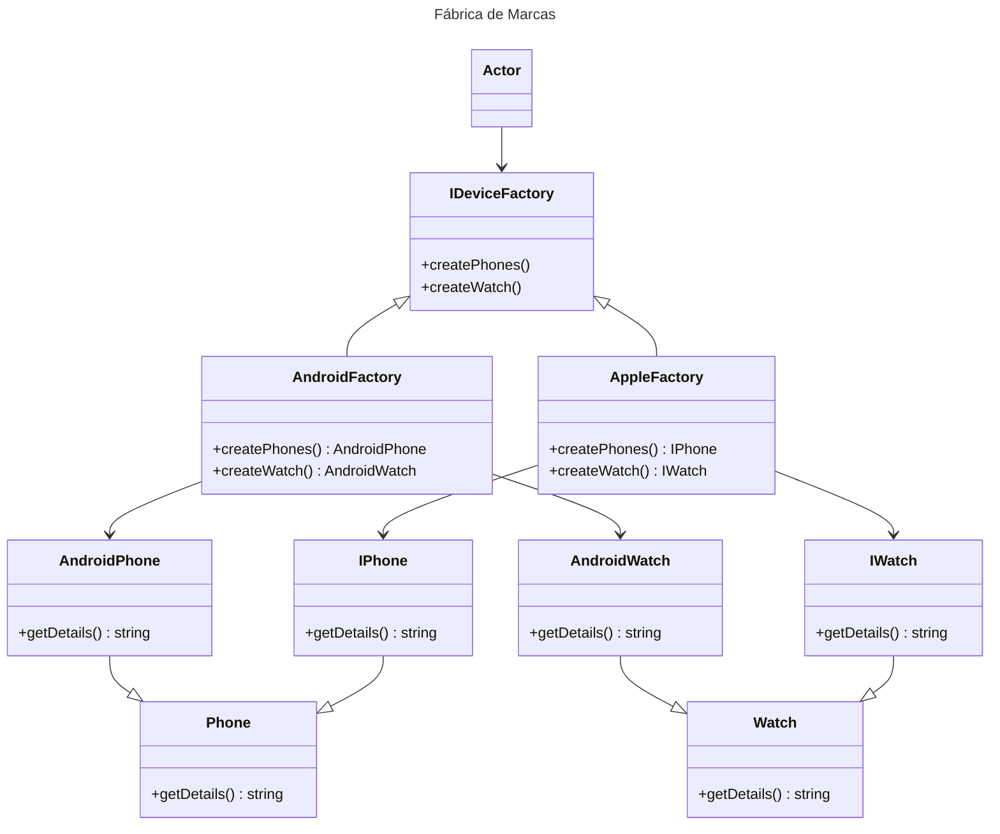

# Abstract Factory

## Intenção
Permite a criação de famílias de objetos relacionados ou dependentes sem especificar suas classes concretas.

## Também conhecido como
Kit de fábrica
Fábrica de fábricas

## Motivação
O código a seguir representa um problema clássico de alto acoplamento e dificuldade de manutenção. 

@import "devicesExample/badCode/src/service/DeviceFactory.ts"


O uso de estruturas como if ou switch para determinar o tipo de dispositivo e suas variantes gera as seguintes limitações:
1. **Complexidade do Cliente**: A lógica para determinar o tipo de dispositivo está embutida na classe DeviceFactory, tornando-a mais difícil de manter e testar.
2. **Dificuldade para Adicionar Novos Produtos**: Sempre que um novo tipo de dispositivo (ou variante) é introduzido, é necessário modificar o método createDevice, violando o princípio aberto/fechado (Open/Closed Principle).

   
`💡 Um design mais modular e flexível pode ser alcançado encapsulando a criação dos dispositivos em fábricas específicas e criando assim um nível de abstração, eliminando a necessidade de lógica condicional dentro do cliente.`


## Aplicabilidade
Use o padrão Abstract Factory quando:
- Um sistema precisa ser independente, gerando uma solução desacoplada para criar produtos relacionados.
- Um sistema precisa ser configurado com uma dentre várias famílias de produtos.
- Desejar garantir que objetos de uma mesma família sejam usados em conjunto.
- Desejar fornecer uma biblioteca de classes de produtos sem alterar o código do cliente e sem expor suas interfaces e implementação.


## Estrutura

```plantuml

    class WidgetFactory {
        +CreateScrollBar()
        +CreateWindow()
    }
    class MotifWidgetFactory extends WidgetFactory  {
        +CreateScrollBar()
        +CreateWindow()
    }
    class PMWidgetFactory  extends WidgetFactory{
        +CreateScrollBar()
        +CreateWindow()
    }
    class Client {
        +operation()
    }
    class ScrollBar
    class MotifScrollBar extends ScrollBar
    class PMScrollBar extends ScrollBar
    class Window
    class MotifWindow extends Window
    class PMWindow  extends Window

    Client --> Window
    Client --> ScrollBar
    MotifWidgetFactory --> MotifScrollBar
    MotifWidgetFactory --> MotifWindow
    PMWidgetFactory --> PMScrollBar
    PMWidgetFactory --> PMWindow
```

## Participantes

### WidgetFactory (Fábrica Abstrata)
- Define uma interface para criar famílias de objetos relacionados, como `CreateScrollBar()` e `CreateWindow()`.

### MotifWidgetFactory e PMWidgetFactory (Fábricas Concretas)
- Implementam a interface `WidgetFactory` para criar produtos específicos.
  - **MotifWidgetFactory**: Cria instâncias de `MotifScrollBar` e `MotifWindow`.
  - **PMWidgetFactory**: Cria instâncias de `PMScrollBar` e `PMWindow`.

### ScrollBar e Window (Produtos Abstratos)
- Representam interfaces ou classes abstratas para os tipos de produtos que serão criados.
  - **ScrollBar**: Interface para barras de rolagem.
  - **Window**: Interface para janelas.

### MotifScrollBar, PMScrollBar, MotifWindow e PMWindow (Produtos Concretos)
- Implementam os produtos abstratos definidos por `ScrollBar` e `Window`.
  - **MotifScrollBar** e **PMScrollBar**: Implementações concretas do produto `ScrollBar`.
  - **MotifWindow** e **PMWindow**: Implementações concretas do produto `Window`.

### Client
- Utiliza apenas as interfaces fornecidas por `WidgetFactory`, `ScrollBar` e `Window` para criar e usar os objetos. 


## Outro exemplo



## Participantes

### IDeviceFactory (Fábrica Abstrata)
- Define a interface para a criação de famílias de produtos relacionados, como `createPhones()` e `createWatch()`.

### AndroidFactory e AppleFactory (Fábricas Concretas)
- Implementam a interface `IDeviceFactory` para criar produtos específicos.
  - **AndroidFactory**: Cria instâncias de `AndroidPhone` e `AndroidWatch`.
  - **AppleFactory**: Cria instâncias de `IPhone` e `IWatch`.

### Phone e Watch (Produtos Abstratos)
- São classes ou interfaces que definem os tipos de produtos criados pelas fábricas.
  - **Phone**: Interface base para os diferentes tipos de telefones.
  - **Watch**: Interface base para os diferentes tipos de relógios.

### AndroidPhone, IPhone, AndroidWatch e IWatch (Produtos Concretos)
- Implementam as interfaces ou classes abstratas definidas por `Phone` e `Watch`.
  - **AndroidPhone**: Implementação concreta do produto `Phone` para dispositivos Android.
  - **IPhone**: Implementação concreta do produto `Phone` para dispositivos Apple.
  - **AndroidWatch**: Implementação concreta do produto `Watch` para dispositivos Android.
  - **IWatch**: Implementação concreta do produto `Watch` para dispositivos Apple.


## Colaborações

- **Cliente e Fábrica Abstrata**: O cliente interage com a interface da Fábrica Abstrata (`AbstractFactory`) para criar famílias de produtos relacionados, sem conhecer as classes concretas.
- **Fábrica Concreta e Produtos Concretos**: Cada Fábrica Concreta (`ConcreteFactory`) cria uma família específica de produtos concretos.
- **Produtos Abstratos e Produtos Concretos**: Os produtos concretos implementam interfaces ou classes abstratas, garantindo que as fábricas concretas possam ser substituídas sem impacto no cliente.

O cliente utiliza a Fábrica Abstrata para criar os objetos, e as Fábricas Concretas instanciam os produtos concretos necessários.


## Consequências

### Benefícios

1. **Consistência entre produtos**: Garante que os produtos criados por uma fábrica pertencem à mesma família e funcionam bem juntos.
   - Exemplo: Um sistema gráfico com botões e barras de rolagem consistentes em estilo.

2. **Isolamento da implementação**: O cliente interage apenas com interfaces ou classes abstratas, deixando o código mais flexível e desacoplado.

3. **Facilidade para introduzir novas famílias de produtos**: Adicionar uma nova família requer apenas criar uma nova Fábrica Concreta e seus produtos concretos.

4. **Organização por famílias**: Estrutura sistemas que precisam criar objetos agrupados logicamente.


### Desvantagens

1. **Aumento da complexidade**: Implementar uma Fábrica Abstrata pode gerar muitas classes (Fábricas Concretas e Produtos Concretos).

2. **Dificuldade em adicionar novos produtos**: Alterar a Fábrica Abstrata para incluir um novo produto afeta todas as Fábricas Concretas existentes.


## Implementação

1. **Definir a Fábrica Abstrata**: Declare métodos para criar cada tipo de produto relacionado.
   ```java
   interface DeviceFactory {
       Phone createPhone();
       Watch createWatch();
   }
   ```

2. **Implementar as Fábricas Concretas**: Implemente a interface da Fábrica Abstrata, criando objetos específicos de uma família.
   ```java
   class AndroidFactory implements DeviceFactory {
       public Phone createPhone() {
           return new AndroidPhone();
       }

       public Watch createWatch() {
           return new AndroidWatch();
       }
   }

   class AppleFactory implements DeviceFactory {
       public Phone createPhone() {
           return new IPhone();
       }

       public Watch createWatch() {
           return new IWatch();
       }
   }
   ```

3. **Definir os Produtos Abstratos**: Crie interfaces ou classes abstratas para os produtos.
   ```java
   interface Phone {
       void getDetails();
   }

   interface Watch {
       void getDetails();
   }
   ```

4. **Implementar os Produtos Concretos**: Implemente os produtos abstratos.
   ```java
   class AndroidPhone implements Phone {
       public void getDetails() {
           System.out.println("Este é um telefone Android.");
       }
   }

   class IPhone implements Phone {
       public void getDetails() {
           System.out.println("Este é um iPhone.");
       }
   }
   ```

5. **Usar o Padrão**: O cliente cria a fábrica concreta desejada e utiliza para criar os produtos.
   ```java
   public class Client {
       public static void main(String[] args) {
           DeviceFactory factory = new AndroidFactory();
           Phone phone = factory.createPhone();
           Watch watch = factory.createWatch();

           phone.getDetails();
           watch.getDetails();
       }
   }
   ```

## Exemplo Completo

Imagine que você quer criar um sistema para produzir telefones e relógios de diferentes marcas:

```java
public interface DeviceFactory {
    Phone createPhone();
    Watch createWatch();
}

public class AndroidFactory implements DeviceFactory {
    public Phone createPhone() {
        return new AndroidPhone();
    }

    public Watch createWatch() {
        return new AndroidWatch();
    }
}

public class AppleFactory implements DeviceFactory {
    public Phone createPhone() {
        return new IPhone();

# Builder

## Intenção
Separar a construção de um objeto complexo da sua representação de modo que o
mesmo processo de construção possa criar diferentes representações.
## Motivação 

Imagine desenvolver um sistema onde objetos complexos podem ter diferentes configurações ou versões. Gerenciar a criação desses objetos sem duplicar código e mantendo a flexibilidade para mudanças futuras pode ser um grande desafio. É nesse contexto que o padrão de projeto **Builder** se torna essencial: ele organiza o processo de construção de objetos, separando a lógica de montagem dos detalhes específicos. Isso não apenas facilita a manutenção, mas também permite reutilizar o mesmo processo de construção para criar diversas representações, promovendo clareza e modularidade no código.

## Exemplo Builder:
Imagine que você está construindo casas. Cada casa pode ter diferentes características, como materiais, design, número de cômodos, ou até mesmo o estilo arquitetônico (moderno, clássico, minimalista).

Em vez de construir cada casa do zero manualmente e misturar todos os detalhes da construção, você contrata um arquiteto (o Builder). Esse arquiteto é especializado em planejar e organizar os passos para criar casas específicas de acordo com as suas necessidades. Um gerente de obra (o Director) coordena o trabalho do arquiteto, garantindo que a construção siga o plano correto.


Se você quiser construir uma casa moderna, contrata um arquiteto especializado em design moderno. Se preferir uma casa clássica, escolhe outro arquiteto. O gerente de obras é sempre o mesmo, mas ele coordena o trabalho com base no arquiteto selecionado.

Aplicando ao software:
O Builder é útil quando você precisa criar diferentes representações ou versões de um objeto complexo, mas quer manter o processo de criação (a lógica de montagem) separado dos detalhes específicos de cada versão. Ele permite que você:

Reaproveite a lógica do "gerente" (o Director) para criar objetos diferentes.
Simplifique a manutenção e a adição de novos tipos de representações sem modificar o processo principal.

## Aplicabilidade

- Use o padrão Builder quando:
    - " o algoritmo para criação de um objeto complexo deve ser independente das partes que compõem o objeto e de como elas são montadas."
    - " o processo de construção deve permitir diferentes representações para o objeto que é construído."

## Participantes do Builder: references GOF

- **Builder**
    -  especifica uma interface abstrata para criação de partes de um objetoproduto.
    
- **ConcreteBuilder**
    -  constrói e monta partes do produto pela implementação da interface de Builder;
    -  define e mantém a representação que cria;
    -  Fornece uma interface para recuperação do produto (por exemplo, GetASCIIText, GetTextWidget).
    
- **Director**
    - constrói um objeto usando a interface de Builder.
    
- **Product**.
    -  representa o objeto complexo em construção. ConcreteBuilder constrói a representação interna do produto e define o processo pelo qual ele é montado;
    -  inclui classes que definem as partes constituintes, inclusive as interfaces para a montagem das partes no resultado final.
      
## Estrutura


## Participantes da motivação:

- **Builder (Arquiteto)**  
  - Especifica uma interface abstrata para projetar e montar as partes de uma casa (ou produto).  
  - **Exemplo**: Planeja os cômodos, o telhado, as portas e outros detalhes estruturais.

- **ConcreteBuilder (Arquiteto de Casa Moderna, Arquiteto de Casa Clássica)**  
  - Implementa a interface do Builder para criar partes específicas da casa.  
  - Define e mantém os detalhes e o design específico da casa sendo construída.  
  - Fornece o método para recuperar a casa pronta (por exemplo, `GetModernHouse()` ou `GetClassicHouse()`).  
  - **Exemplo**: Um arquiteto especializado em casas modernas cria designs com janelas amplas e linhas retas, enquanto o de casas clássicas prioriza ornamentos e telhados inclinados.

- **Director (Gerente de Obras)**  
  - Coordena o processo de construção seguindo um plano pré-definido.  
  - Não se preocupa com os detalhes de cada tipo de casa, apenas segue o plano do arquiteto escolhido.  
  - **Exemplo**: O gerente supervisiona os trabalhadores para garantir que as casas modernas ou clássicas sejam construídas corretamente.

- **Product (Casa)**  
  - Representa o objeto final criado.  
  - É o resultado do trabalho coordenado pelo Director e definido pelo ConcreteBuilder.  
  - **Exemplo**: A casa moderna com janelas amplas e linhas retas, ou a casa clássica com ornamentos e telhado inclinado.
 
## Exemplo sem Builder: 


## Exemplo com Builder: 

@startuml
class Casa {
  - fundacao: String
  - paredes: String
  - telhado: String
}

abstract class ConstrutorCasa {
  # casa: Casa
  + criarNovaCasa()
  + getCasa(): Casa
  + {abstract} construirFundacao()
  + {abstract} construirParedes()
  + {abstract} construirTelhado()
}

class ConstrutorCasaModerna extends ConstrutorCasa
class ConstrutorCasaClassica extends ConstrutorCasa

class Diretor {
  - construtor: ConstrutorCasa
  + setConstrutor(construtor: ConstrutorCasa)
  + construirCasa()
  + getCasa(): Casa
}

Diretor --> ConstrutorCasa : usa
ConstrutorCasa --> Casa : cria

note right of ConstrutorCasa
  Construtor concreto
  define como a casa é construída
end note
@enduml


## Colaborações: 

- O Gerente de Obras depende de um arquiteto específico para executar os passos necessários à construção de uma casa. Ele coordena o processo, chamando os métodos do arquiteto em uma sequência definida, sem se preocupar com os detalhes da implementação de cada passo.
- O arquiteto é responsável por construir as partes individuais da casa (fundação, paredes, telhado) e entregar o resultado final. Cada implementação do arquiteto conhece os detalhes específicos de um estilo de casa.
- O Gerente de Obras obtém a casa finalizada do arquiteto e a entrega ao cliente ou a utiliza em outra parte do sistema.
- O cliente especifica ao Gerente de Obras qual tipo de casa deseja construir. O Gerente de Obras então escolhe o arquiteto apropriado para realizar o trabalho

## Consequências:

1. Separação entre o processo de construção e a representação final:
- O padrão isola a lógica de criação da estrutura de um objeto, permitindo modificar a maneira como os objetos são construídos sem alterar sua lógica interna.
- A lógica para construir o objeto é centralizada no Director, enquanto os detalhes específicos ficam nos Builders. Isso facilita a criação de diferentes representações (casas modernas, clássicas, etc.) sem duplicar código.
Manutenção facilitada:

2. Novos tipos de representações podem ser adicionados criando novos Builders, sem modificar o código do Director, promovendo o princípio Open/Closed.
Facilidade na construção de objetos complexos:
- O padrão organiza a construção de objetos que possuem muitos passos e dependências, mantendo o código mais limpo e legível.
- Permite que o Director controle a sequência e os detalhes da construção sem se preocupar com os atributos específicos de cada tipo de objeto.
- A implementação do padrão adiciona várias classes (como Builder, ConcreteBuilders e Director), o que pode ser considerado um overhead desnecessário em sistemas simples.
- Para sistemas pequenos ou com objetos simples, o uso do padrão pode parecer excessivo, já que criar uma classe para cada variação de objeto pode ser desnecessário

## Implementação:

O Cliente escolhe o tipo de objeto que deseja construir e passa essa decisão para o Director.
O Director recebe um Builder (por exemplo, ArquitetoCasaModerna) e chama os métodos do Builder em uma sequência pré-definida.
O ConcreteBuilder executa os métodos e configura as partes do objeto (Casa), armazenando o estado internamente.
Após completar o processo, o ConcreteBuilder retorna o objeto final para o Cliente.


### Exemplo:

```java

class Casa {
    private String fundacao;
    private String paredes;
    private String telhado;

    public void setFundacao(String fundacao) {
        this.fundacao = fundacao;
    }

    public void setParedes(String paredes) {
        this.paredes = paredes;
    }

    public void setTelhado(String telhado) {
        this.telhado = telhado;
    }

    @Override
    public String toString() {
        return "Casa com fundação: " + fundacao + ", paredes: " + paredes + ", telhado: " + telhado;
    }
}

// Interface Builder
abstract class ConstrutorCasa {
    protected Casa casa;

    public void criarNovaCasa() {
        casa = new Casa();
    }

    public Casa getCasa() {
        return casa;
    }

    public abstract void construirFundacao();
    public abstract void construirParedes();
    public abstract void construirTelhado();
}

// ConcreteBuilder: ConstrutorCasaModerna
class ConstrutorCasaModerna extends ConstrutorCasa {

    @Override
    public void construirFundacao() {
        casa.setFundacao("Fundação de concreto reforçado");
    }

    @Override
    public void construirParedes() {
        casa.setParedes("Paredes de vidro e aço");
    }

    @Override
    public void construirTelhado() {
        casa.setTelhado("Telhado plano com painéis solares");
    }
}

// ConcreteBuilder: ConstrutorCasaClassica
class ConstrutorCasaClassica extends ConstrutorCasa {

    @Override
    public void construirFundacao() {
        casa.setFundacao("Fundação de concreto tradicional");
    }

    @Override
    public void construirParedes() {
        casa.setParedes("Paredes de tijolo");
    }

    @Override
    public void construirTelhado() {
        casa.setTelhado("Telhado inclinado de telhas cerâmicas");
    }
}

    public Watch createWatch() {
        return new IWatch();
    }
}

public interface Phone {
    void getDetails();
}

public class AndroidPhone implements Phone {
    public void getDetails() {
        System.out.println("Telefone Android criado.");
    }
}

public class IPhone implements Phone {
    public void getDetails() {
        System.out.println("iPhone criado.");
    }
}
```

## Usos Conhecidos

1. **Sistemas gráficos multiplataforma**: Criar interfaces adaptadas para diferentes sistemas operacionais.
2. **Bibliotecas de persistência**: Fornecer implementações diferentes para diversos tipos de bancos de dados.
3. **Frameworks de jogos**: Configurar texturas, sons e objetos específicos para cada plataforma.


## Conclusão

O padrão **Abstract Factory** é uma solução poderosa para criar famílias de objetos relacionados, mantendo a consistência e a flexibilidade do código. Ele é ideal para sistemas que precisam suportar múltiplas variações de produtos, desde que a complexidade adicional seja gerenciável.


// Diretor
class Diretor {
    private ConstrutorCasa construtor;

    public void setConstrutor(ConstrutorCasa construtor) {
        this.construtor = construtor;
    }

    public void construirCasa() {
        construtor.criarNovaCasa();
        construtor.construirFundacao();
        construtor.construirParedes();
        construtor.construirTelhado();
    }

    public Casa getCasa() {
        return construtor.getCasa();
    }
}

public class BuilderExample {
    public static void main(String[] args) {
        Diretor diretor = new Diretor();

        // Construir uma casa moderna
        ConstrutorCasa construtorModerno = new ConstrutorCasaModerna();
        diretor.setConstrutor(construtorModerno);
        diretor.construirCasa();
        System.out.println(diretor.getCasa());

        // Construir uma casa clássica
        ConstrutorCasa construtorClassico = new ConstrutorCasaClassica();
        diretor.setConstrutor(construtorClassico);
        diretor.construirCasa();
        System.out.println(diretor.getCasa());
    }
}
```

## Usos conhecidos:

O padrão **Builder** é amplamente utilizado em várias situações onde objetos complexos precisam ser criados de maneira flexível e reutilizável.

###  Interface de Criação de GUI (Interfaces Gráficas de Usuário)

**Exemplo**: **Frameworks de interface de usuário como Swing ou JavaFX**
- Em frameworks de interface gráfica, onde você pode criar painéis, botões e menus com várias opções, como texto, ícones, eventos, cores, etc.
- O padrão Builder ajuda a criar componentes complexos de interface sem a necessidade de construir cada elemento manualmente.

**Aplicação**: Frameworks de interface de usuário em Java ou C#, onde você deseja permitir a criação de uma interface flexível e modular.

---

### Construção de Consultas Complexas (Query Builders)

**Exemplo**: Consulta a bancos de dados SQL
- Quando você precisa construir consultas SQL complexas com diversas condições, joins, agrupamentos, etc., o Builder pode ser usado para criar essas consultas de forma legível e modular.
- Isso permite que você adicione facilmente novas cláusulas ou condições sem quebrar o código.

**Aplicação**: Bibliotecas como **Hibernate Criteria API** ou **JPA Criteria API**, que permitem construir consultas dinâmicas e flexíveis sem concatenar strings SQL manualmente.

---

### . Criação de Objetos de Documentos (Exemplo: PDF ou HTML)

**Exemplo**: **Geradores de Documentos**
- Geradores de documentos (PDF, Word, HTML) onde cada documento pode ter diferentes seções, tabelas, listas, parágrafos, imagens, etc.
- O Builder permite que você construa esses documentos de forma modular e eficiente, sem ter que lidar com a complexidade de cada componente individual.

**Aplicação**: Geradores de relatórios PDF em bibliotecas como **Apache PDFBox** ou **iText**, onde os documentos podem ser construídos passo a passo (tabelas, textos, imagens, etc.) utilizando um único objeto `Builder`.

---

###  Criando APIs Fluentes

- Muitas vezes, o padrão Builder é usado para criar **APIs fluentes**, onde você pode encadear chamadas de método de forma legível e fácil de usar, configurando um objeto de forma incremental.
- O padrão é ideal para cenários onde você tem muitas opções de configuração e deseja permitir um fluxo contínuo de chamadas de métodos.

**Aplicação**: Configuração de APIs em bibliotecas Java ou frameworks como **Spring**, onde você pode configurar beans ou objetos de forma incremental, por exemplo, ao definir uma configuração de serviço, a configuração de banco de dados, ou a configuração de segurança.

---

### Construção de Objetos Imutáveis

- Em muitas linguagens de programação, o padrão Builder é utilizado para construir objetos imutáveis, onde os objetos não podem ser alterados após sua criação. 
- O Builder é usado para preencher os valores do objeto durante a construção, e uma vez que o objeto está pronto, ele não pode ser modificado.

**Aplicação**: Uso do Builder em bibliotecas como **Guava** ou **Java**, quando se deseja criar objetos imutáveis com um número variável de parâmetros.

--- 
### Compilação de Modelos de Arquitetura
Arquiteturas de software complexas
O padrão Builder é útil na criação de componentes de software que exigem configuração detalhada, como componentes de sistemas distribuídos ou microserviços, onde cada serviço pode ter diferentes opções de configuração e implementação.
Arquitetura de sistemas distribuídos em que você precisa construir a estrutura de um sistema com múltiplos nós e serviços, cada um com suas próprias configurações e opções.

.
[Mermaid Class Diagram.html](https://mermaid.js.org/syntax/classDiagram.html)

