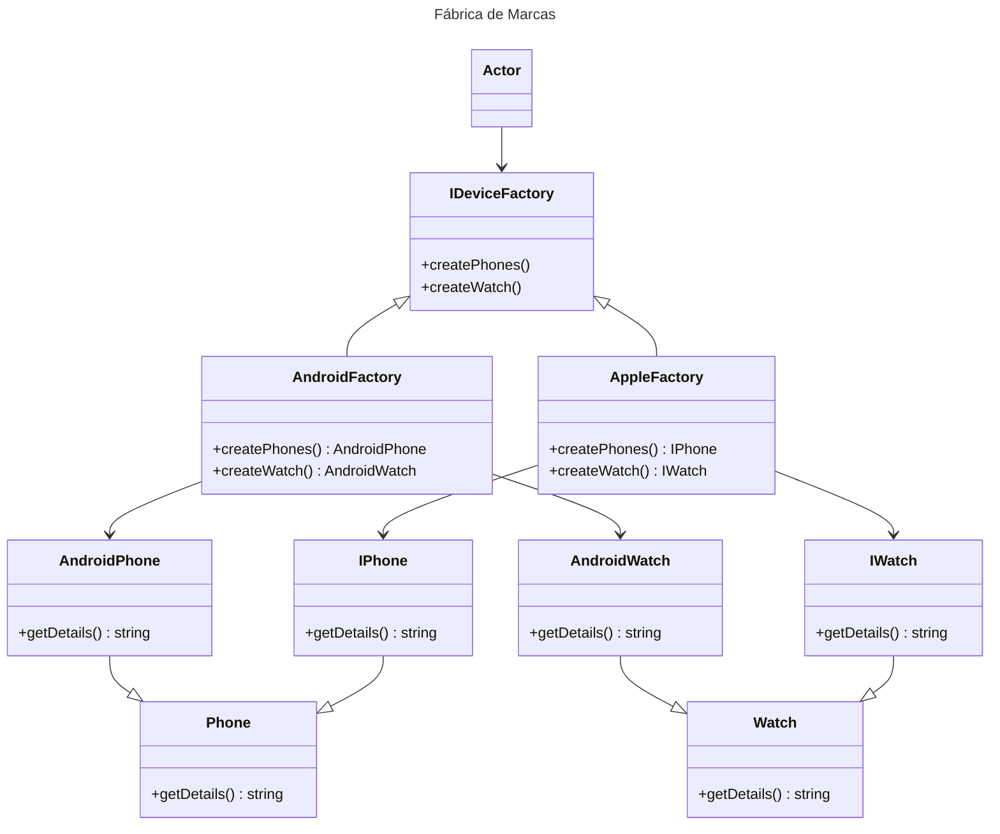

# Abstract Factory

## Intenção
Permite a criação de famílias de objetos relacionados ou dependentes sem especificar suas classes concretas.

## Também conhecido como
Kit de fábrica
Fábrica de fábricas

## Motivação
O código a seguir representa um problema clássico de alto acoplamento e dificuldade de manutenção. 

```typescript
import { AndroidPhone } from "../models/AndroidPhone";
import { AndroidWatch } from "../models/AndroidWatch";
import { ApplePhone } from "../models/ApplePhone";
import { AppleWatch } from "../models/AppleWatch";

export class DeviceFactory {
    createDevice(type: string, device: string): any {
        if (type === "Android" && device === "Watch") {
            return new AndroidWatch();
        } else if (type === "Android" && device === "Phone") {
            return new AndroidPhone();
        } else if (type === "Apple" && device === "Watch") {
            return new AppleWatch();
        } else if (type === "Apple" && device === "Phone") {
            return new ApplePhone();
        } else {
            throw new Error("Invalid type or device");
        }
    }
}
```
O uso de estruturas como if ou switch para determinar o tipo de dispositivo e suas variantes gera as seguintes limitações:
1. Complexidade do Cliente: A lógica para determinar o tipo de dispositivo está embutida na classe DeviceFactory, tornando-a mais difícil de manter e testar.
2. Dificuldade para Adicionar Novos Produtos: Sempre que um novo tipo de dispositivo (ou variante) é introduzido, é necessário modificar o método createDevice, violando o princípio aberto/fechado (Open/Closed Principle).
   
💡 Um design mais modular e flexível pode ser alcançado encapsulando a criação dos dispositivos em fábricas específicas e criando assim um nível de abstração, eliminando a necessidade de lógica condicional dentro do cliente.

## Aplicabilidade
Use o padrão Abstract Factory quando:
- Um sistema precisa ser independente, gerando uma solução desacoplada para criar produtos relacionados.
- Um sistema precisa ser configurado com uma dentre várias famílias de produtos.
- Desejar garantir que objetos de uma mesma família sejam usados em conjunto.
- Desejar fornecer uma biblioteca de classes de produtos sem alterar o código do cliente e sem expor suas interfaces e implementação.


## Estrutura



## Participantes

[Mermaid Class Diagram.html](https://mermaid.js.org/syntax/classDiagram.html)

[Markdown](https://docs.github.com/pt/get-started/writing-on-github/getting-started-with-writing-and-formatting-on-github/basic-writing-and-formatting-syntax)
