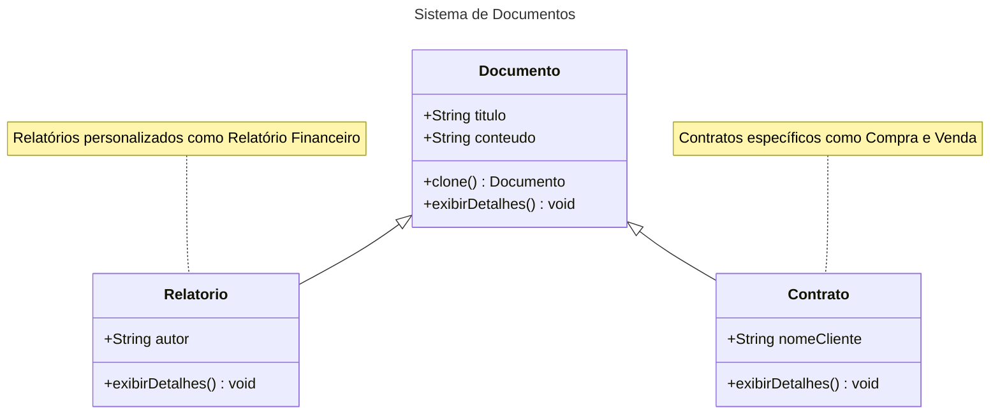

# Prototype

## Intenção

## Motivação

## Aplicabilidade

##Estrutura

## Participantes 
- Documento (abstrato)
- Contrato (clone)
- Relatorio (clone)

## Outro Exemplo

## Consequências

## Implementação 

## Exemplo de código 

## Usos Conhecidos 

## Padrões Relacionados 

## Referências 

[Mermaid Class Diagram.html](https://mermaid.js.org/syntax/classDiagram.html)

[Markdown](https://docs.github.com/pt/get-started/writing-on-github/getting-started-with-writing-and-formatting-on-github/basic-writing-and-formatting-syntax)
