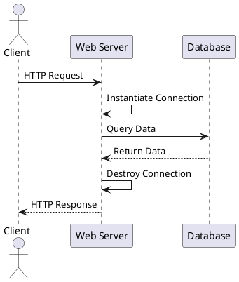
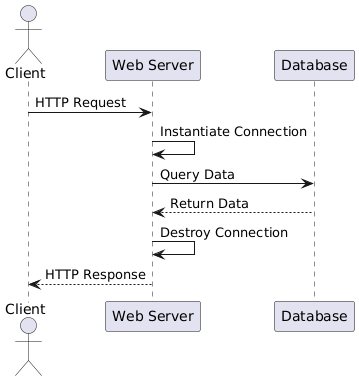
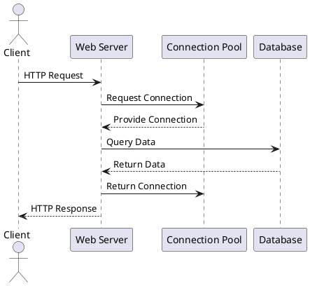
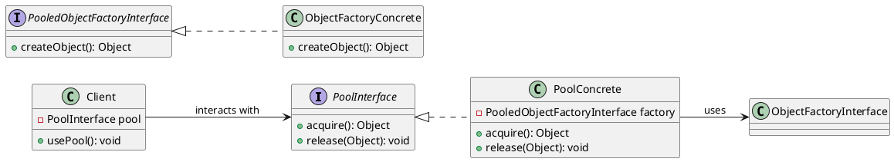
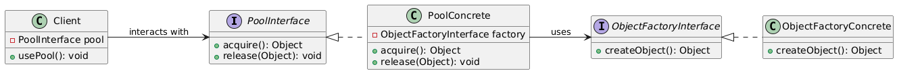

# Object Pool (Padrão Criacional)

## Intenção

Gerenciar a criação, armazenamento, emprestimo, retomada e reutilização de instancias de objeto, com o objetivo de controlar a quantidade de instancias existentes ou previnir o processo de criação e destruição recorentes quando estes forem considerados caros.

## Também conhecido como

Pool de recursos

## Motivação

Para se comunicar com um banco de dados, é necessario estabelecer uma "conexão" com ele:

```java
Connection connection = DriverManager.getConnection(
                "jdbc:mysql://localhost:3306/meu_banco",
                "usuario",
                "senha" )

Statement statement = connection.createStatement();

ResultSet resultSet = statement.executeQuery("SELECT id, nome FROM clientes");
```

Em uma aplicação como um sistema web, onde varias requisições chegam o tempo todo, e para cada requisição é comum termos que acessar o banco de dados uma ou mais vezes, nesse caso, para cada acesso precisariamos instanciar a conexão.




Isso rapidamente apresenta um problema, estabelecer uma conexão com banco de dados é um processo relativamente caro e demorado, é necessario a realização de diversas etapas tanto no servidor de banco quanto no cliente que está se conectando. Além disso, servidores de banco de dados possuem um numero maximo de conexões simultaneas que ele pode manter.

Em um cenario em que por exemplo uma aplicação receba 1000 requisições/s, e para cada requisição sejam necessarias em media 2 consultas ao banco de dados, isso significa que estariamos instanciando e destruindo 2000 conexões por segundo, um numero que facilmente extrapolaria o limite de conexões de um banco de dados.

Em vez disso, usando o pattern de object pool, podemos implementar uma classe que sirva como pool de conexões, dessa forma, ao precisarmos de uma conexão solicitamos ao pool, que ira nos fornecer uma que ja existe. Ao terminamos de usar a conexão, devolvemos ela ao pool.





## Aplicabilidade

Use object pool quando:

- For **demorado** criar uma instancia
- For **caro** em recursos criar uma instancia
- For **demorado** destruir uma instancia
- For **caro** em recursos destruir uma instancia

- Existe um **limite** de quantas instancias possam existir simultaneamente

Com **recursos**, queremos dizer por exemplo cpu, ram, disco e rede por exemplo

Não use object pool quando:

- O **custo** de **manter** a instancia, mesmo quando não está sendo usada, supera o custo de instanciala.

## Estrutura





## Participantes

- **PoolInterface**
    - Define uma interface comum para todas as implementações de classes de pool de objetos
- **ObjectFactoryInterface** 
    - Define uma interface comum para todas as implementações de classes fabricas de objetos que seram guardadas em pool.
- **Client**
   - Aquele que necessita das instancias do objeto que sera guardado em pool.

## Implementação

- Implementação de um pool

```java
package com.example.implementations.simple;

import java.util.ArrayList;
import java.util.List;

import com.example.interfaces.PoolInterface;
import com.example.interfaces.PooledObjectFactory;

public class SimplePool<T> implements PoolInterface<T> {
    private List<T> instanciasLivres; 
    private List<T> instanciasEmUso;  
    private PooledObjectFactory<T> factory;

    public SimplePool(int size, PooledObjectFactory<T> factory) {
        this.factory = factory;
        this.instanciasLivres = new ArrayList<>();
        this.instanciasEmUso = new ArrayList<>();

        for (int i = 0; i < size; i++) {
            instanciasLivres.add(factory.create());
        }
    }

    @Override
    public T acquire() {
        if (!instanciasLivres.isEmpty()) {
            T instance = instanciasLivres.remove(0);  
            instanciasEmUso.add(instance);  
            return instance;
        }
        return null;
    }

    @Override
    public void release(T instance) {
        if (instanciasEmUso.remove(instance)) {
            instanciasLivres.add(instance);
        }
    }

    @Override
    public void destroyAll() {
        for (T instance : instanciasLivres) {
            factory.destroy(instance);
        }
        for (T instance : instanciasEmUso) {
            factory.destroy(instance);
        }
    }
}
```

## Exemplo de código

- Uso de um pool

```java
PoolInterface<CheapObject> pool = new SimplePool<CheapObject>(1, new CheapObjectFactory());

        for (int i = 0; i < 100; i++) {
            CheapObject cheapObject = pool.acquire();
            cheapObject.doSomething();
            pool.release(cheapObject);
        }
```

## Usos conhecidos

- Conexões com bancos de dados geralmente são gerenciados por um object pool

- Servidores web e de aplicação implementam um pool de threads para o processamento de requisições

- Em aplicações multithreads, threads de trabalho são gerenciadas por um object pool

## Padrão relacionados


## Referências
