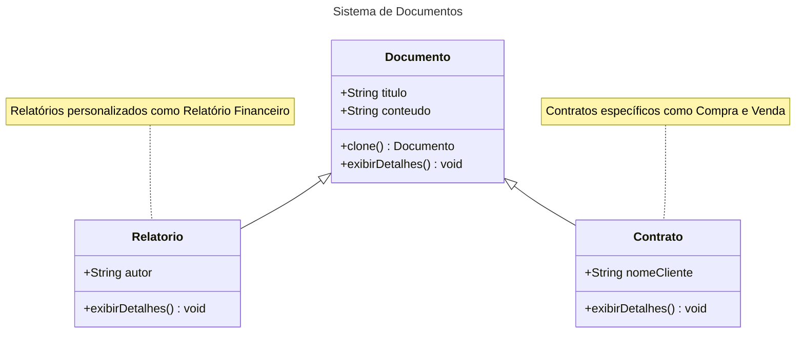
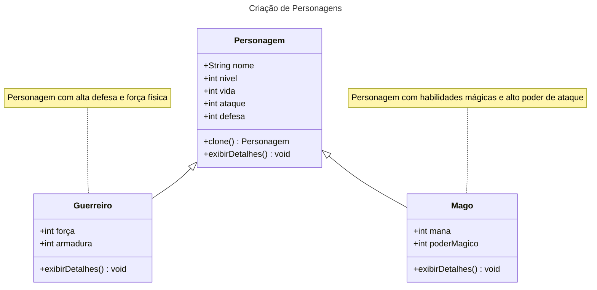

# Prototype

## Intenção

Tem como objetivo permitir a criação de novos objetos a partir de um modelo (template) ou protótipo existente, em vez de criar uma nova instância do zero. Facilitando na criação de novos objetos que são complexos ou tem inicialização custosa, permitindo uma clonagem eficiente dos objetos, com a possibilidade de modificar ou customizar os novos objetos conforme necessário.


## Motivação

Imagine que você trabalha em uma empresa de automação de processos, e o desafio do momento é criar um sistema de gerenciamento de documentos. Cada documento pode ter um título e conteúdo personalizado, como contratos, atas de reunião e propostas comerciais.

Inicialmente, você planejou criar novas instâncias de documentos usando construtores para preencher manualmente o título e o conteúdo. Mas, à medida que os requisitos cresceram, ficou claro que certos documentos, como um contrato padrão ou uma ata de reunião básica, eram frequentemente reutilizados com pequenas alterações. Cada vez que um usuário queria criar um novo contrato, precisava preencher todos os detalhes novamente, o que era ineficiente e sujeito a erros.

Então, surge a ideia: e se você pudesse simplesmente clonar um modelo existente de documento, ajustando apenas as informações necessárias? É aqui que o padrão Prototype entra em cena.

No seu sistema, você implementa uma classe abstrata Documento que define o título e o conteúdo. Essa classe também implementa a interface Cloneable para permitir que instâncias de documentos sejam copiadas. Com isso, você pode criar protótipos de documentos (como "Contrato Padrão" ou "Ata Básica") e simplesmente cloná-los quando necessário.

Por exemplo:

Quando o departamento de vendas precisa de um novo contrato, o sistema clona o protótipo do contrato padrão e insere as informações do cliente.
Para atas de reunião, o sistema utiliza o protótipo da ata básica, ajustando o conteúdo com os detalhes da reunião específica.


## Aplicabilidade
O padrão Prototype é ideal em cenários onde se busca maior flexibilidade e eficiência no processo de criação de objetos. Ele é recomendado nos seguintes casos:

Independência da criação de objetos: Quando é necessário que o sistema funcione de forma independente de como os objetos são criados, compostos ou representados. Isso reduz o acoplamento e simplifica a manutenção.

Definição dinâmica das classes a serem instanciadas: Em situações onde as classes de objetos precisam ser especificadas durante a execução do programa, como em sistemas que utilizam carregamento dinâmico de dados ou componentes.

Evitar hierarquias de classes complexas: Quando seria necessário criar uma hierarquia paralela de classes de fábrica para suportar a criação de produtos. O Prototype elimina essa necessidade ao permitir que os objetos sejam clonados diretamente.

Gerenciamento eficiente de estados diferentes: Quando uma classe pode assumir apenas um número limitado de combinações de estados, é mais prático criar protótipos para cada configuração inicial e cloná-los conforme necessário, em vez de configurar manualmente cada instância repetidamente.


## Estrutura


## Participantes 

- Documento (abstrato): Define os atributos e métodos comuns de um documento. 
- Contrato (clone): Utiliza como modelo (template) a classe documento, e adiciona um atrituto específico do contrato.
- Relatorio (clone): Utiliza como modelo (template) a classe documento, e adiciona um atrituto específico do relatório.

## Outro Exemplo

## Participantes

- Personagem (abstrato): Define os atributos e métodos comuns para todos os personagens.
- Guerreiro (clone): Representa um personagem do tipo Guerreiro, com atributos relacionados à força e defesa.
- Mago (clone): Representa um personagem do tipo Mago, com atributos relacionados à mana e poder mágico.


## Consequências
Prototype tem muitas das mesmas consequências que o Abstract Factory e Builder:
- Oculta as classes de produtos concretos do cliente, reduzindo a quantidade de informações que ele precisa conhecer, permitindo que o cliente crie novos objetos a partir de protótipos existentes, sem precisar entender ou interagir diretamente com o código das classes concretas.
  
### Benefícios adicionais do Prototype:

1. Modificação dinâmica de protótipos: O padrão permite modificar ou estender protótipos de objetos durante a execução do programa.
2. Criação de objetos com valores variados: Permite criar novos objetos com diferentes valores baseados em um protótipo, ajustando suas propriedades conforme necessário.
3. Variação de estrutura através de clonagem: A estrutura de um objeto pode ser alterada ao cloná-lo a partir de um protótipo e adicionar ou modificar seus atributos.
4. Redução de subclasses: Evita a criação de múltiplas subclasses, criando objetos a partir de protótipos e personalizando-os conforme necessário.
5. Criação dinâmica de objetos: O padrão Prototype permite criar e configurar objetos de maneira dinâmica, sem a necessidade de uma hierarquia rígida de classes.

- O ponto fraco do Prototype é a complexidade envolvida na clonagem de objetos com estruturas internas complexas. Quando um objeto possui referências a outros objetos ou contém um estado interno complexo, pode ser difícil garantir que a clonagem seja feita corretamente, sem gerar problemas como cópias superficiais em vez de cópias profundas (deep copies). Isso pode resultar em erros, como a modificação indesejada de objetos compartilhados entre o protótipo e suas cópias, além de aumentar a complexidade do código para gerenciar essas clonagens de maneira eficaz.


## Implementação 
 ### Pode ser um desafio implementar de maneira correta o padrão prototype, dentre eles:
1. Implementar a operação de clonagem corretamente : O padrão Prototype exige a implementação de uma operação de clonagem precisa para garantir que o novo objeto seja uma cópia exata do protótipo, sem causar problemas como referências compartilhadas inadvertidas.

2. Gerenciar protótipos de forma eficiente : Em sistemas complexos, pode ser difícil organizar e manter os protótipos de maneira eficiente, garantindo que eles sejam facilmente reutilizáveis e adaptáveis para diferentes tipos de objetos.

3. Garantir a inicialização adequada dos clones: Quando se clona um objeto, é importante garantir que a inicialização do clone seja feita corretamente, com todos os atributos e estados sendo copiados ou ajustados de acordo com o comportamento desejado.

### Processo de clonagem
  
O processo de clonagem de um objeto pode ser feito usando duas abordagens:

1. Shallow Copy (ou cópia superficial): 
Copia os valores primitivos e as referências dos objetos, mas não os objetos em si. As referências no novo objeto apontam para os mesmos objetos que as do original, ou seja, o objeto pai é clonado, mas seus filhos são compartilhados entre os objetos.

2. Deep Copy (ou cópia profunda):
Copia o objeto e todos os objetos aos quais ele se refere, criando novas instâncias para todos os elementos. O objeto pai e todos os objetos contidos nele são clonados, garantindo que não haja referências compartilhadas.

- Na implementação, você pode achar o prototype bastante parecido com a **Herança**, pois ambos permitem que objetos ou classes compartilhem propriedades e métodos. No entanto, eles são diferentes em sua implementação e estrutura.
  
- A herança clássica é baseada em classes e estabelece uma hierarquia fixa entre elas, onde as subclasses herdam os métodos e propriedades das classes pai. Já o prototype é baseado em objetos e referências de protótipos, permitindo que objetos compartilhem comportamento dinamicamente. A herança clássica é mais rígida e hierárquica, enquanto o prototype oferece flexibilidade, pois as relações podem ser modificadas em tempo de execução.
  
- Dito isso, no JavaScript, é possível simular o mecanismo da herança, utilizando o prototype para compartilhar propriedades e métodos entre objetos. Embora o JavaScript não tenha um sistema de classes como em linguagens tradicionais, ele permite que objetos "herdem" comportamentos de outros objetos por meio das suas referências de protótipo. Isso é feito de forma dinâmica, permitindo flexibilidade, como a capacidade de modificar ou substituir o protótipo de um objeto a qualquer momento, sem a necessidade de uma hierarquia fixa de classes.

## Exemplo de código 
### 1. Criando classe abstrata, que servirá como protótipo
```java
 public abstract class Documento implements Cloneable {
    private String titulo;
    private String conteudo;

    public Documento(String titulo, String conteudo) {
        this.titulo = titulo;
        this.conteudo = conteudo;
    }

    public String getTitulo() {
        return titulo;
    }

    public void setTitulo(String titulo) {
        this.titulo = titulo;
    }

    public String getConteudo() {
        return conteudo;
    }

    public void setConteudo(String conteudo) {
        this.conteudo = conteudo;
    }

    @Override
    public Documento clone() {
        try {
            return (Documento) super.clone();
        } catch (CloneNotSupportedException e) {
            throw new RuntimeException("Erro ao clonar documento!", e);
        }
    }

    public abstract void exibirDetalhes();
}
 
```
**Explicação: A classe Documento é abstrata e implementa a interface Cloneable, permitindo que objetos derivados sejam clonados. Ela possui dois atributos, titulo e conteudo, com métodos getters e setters para acesso e modificação. O método clone() é sobrescrito para criar uma cópia do documento utilizando o método super.clone(), realizando uma clonagem superficial. Além disso, a classe contém um método abstrato exibirDetalhes(), que deve ser implementado pelas subclasses para exibir informações específicas do documento. Essa estrutura facilita a criação de diferentes tipos de documentos com base em um modelo comum.**

### 2. Criando a classe Contrato, que é uma cópia da classe Documento
```java
public class Contrato extends Documento {
    private String nomeCliente;

    public Contrato(String titulo, String conteudo, String nomeCliente) {
        super(titulo, conteudo);
        this.nomeCliente = nomeCliente;
    }

    public String getNomeCliente() {
        return nomeCliente;
    }

    public void setNomeCliente(String nomeCliente) {
        this.nomeCliente = nomeCliente;
    }

    @Override
    public void exibirDetalhes() {
        System.out.println("Contrato:");
        System.out.println("Título: " + getTitulo());
        System.out.println("Conteúdo: " + getConteudo());
        System.out.println("Cliente: " + nomeCliente);
        System.out.println();
    }
}
```
**Explicação: A classe Contrato estende a classe Documento e adiciona um atributo específico, nomeCliente, que representa o nome do cliente associado ao contrato. O construtor da classe Contrato chama o construtor da classe pai Documento para inicializar os atributos titulo e conteudo, além de inicializar nomeCliente. Os métodos getNomeCliente() e setNomeCliente() permitem acessar e modificar o nome do cliente. O método exibirDetalhes() é uma implementação do método abstrato da classe pai, exibindo as informações completas do contrato, incluindo o título, o conteúdo e o nome do cliente, proporcionando uma exibição dos detalhes do contrato.**

### 3. Conclusão
O código define uma estrutura de documentos utilizando o padrão Prototype. A classe Documento é abstrata e implementa a interface Cloneable, permitindo a clonagem de objetos. Ela possui atributos básicos como titulo e conteudo, com métodos para acessá-los e modificá-los, e um método abstrato exibirDetalhes() que deve ser implementado nas subclasses. A classe Contrato estende Documento, adicionando o atributo nomeCliente e implementando o método exibirDetalhes() para mostrar informações específicas do contrato. Essa estrutura permite a criação de documentos clonáveis e personalizados, como contratos, facilitando a reutilização e modificação de objetos sem a necessidade de reescrever todo o conteúdo.


## Usos Conhecidos 

### O padrão Prototype está bastante presente nos dias atuais, exploraremos alguns exemplos práticos utilizados no dia a dia, tanto no desenvolvimento de software quanto em outras áreas, que por muitas vezes acabamos nem percebendo.

1. Desenvolvimento de Jogos:
No desenvolvimento de jogos, o Prototype é utilizado para criar personagens e objetos semelhantes, mas com variações. Em vez de recriar objetos complexos de personagens, como magos ou guerreiros, a partir do zero, é possível criar um personagem genérico (protótipo) e, a partir dele, gerar clones com atributos diferentes, como pontos de vida ou força.

2. Gerenciamento de Documentos e Relatórios:
O padrão Prototype é útil para duplicar documentos e relatórios com estruturas semelhantes, mas com dados específicos modificados. Em sistemas de geração de relatórios ou processamento de texto, é comum utilizar um protótipo de documento para criar novas instâncias de forma rápida.

3. Interfaces de Usuário (UI):
Em sistemas de interface de usuário, o Prototype pode ser usado para criar componentes reutilizáveis. Elementos como botões, caixas de texto e tabelas podem ser definidos como protótipos, e a partir deles, clones podem ser criados com diferentes propriedades, como cor, tamanho ou comportamento.

4. Gerenciamento de Configurações:
Em sistemas que exigem configurações dinâmicas, como em plataformas de e-commerce ou jogos, o padrão Prototype pode ser usado para criar novas configurações baseadas em um modelo inicial. Isso é útil quando as configurações de diferentes módulos ou componentes são semelhantes, mas com pequenas variações.

5. Fluxos de Trabalho e Processos:
O conceito de clonagem de fluxos de trabalho ou processos é uma aplicação interessante do padrão Prototype. Isso permite a criação de diferentes versões de um processo com variações mínimas, com base em um modelo genérico.

6. Produção em Massa de Produtos:
No mundo físico, o Prototype é utilizado em linhas de produção para criar produtos com variações, mas com uma base comum. O padrão permite a criação de diferentes versões de um produto, clonando um protótipo e personalizando detalhes conforme necessário.


## Padrões Relacionados 
Prototype e Abstract Factory têm em comum o objetivo de **abstrair a criação de objetos**, permitindo ao cliente criar instâncias sem conhecer detalhes de implementação. O Prototype cria objetos clonando um protótipo existente, enquanto o Abstract Factory cria famílias de objetos relacionados. Eles podem ser usados em conjunto, com o Abstract Factory coordenando e armazenando a criação de produtos (protótipos) e o Prototype permitindo clonar e personalizar esses objetos conforme necessário.

## Referências 

GAMMA, Erich; HELM, Richard; JOHNSON, Ralph; VLISSIDES, John. Padrões de Projetos: Soluções Reutilizáveis de Software Orientados a Objetos. Trad. Luiz A. Meirelles Salgado; Fabiano Borges Paulo. 1. ed. Porto Alegre: Bookman, 2000.


[Macoratti.net](https://macoratti.net/21/08/c_prototype1.htm#:~:text=Deep%20Copy%20(ou%20c%C3%B3pia%20profunda,os%20objetos%20que%20o%20cont%C3%AAm. )

[Mermaid Class Diagram.html](https://mermaid.js.org/syntax/classDiagram.html)

[Markdown](https://docs.github.com/pt/get-started/writing-on-github/getting-started-with-writing-and-formatting-on-github/basic-writing-and-formatting-syntax)
